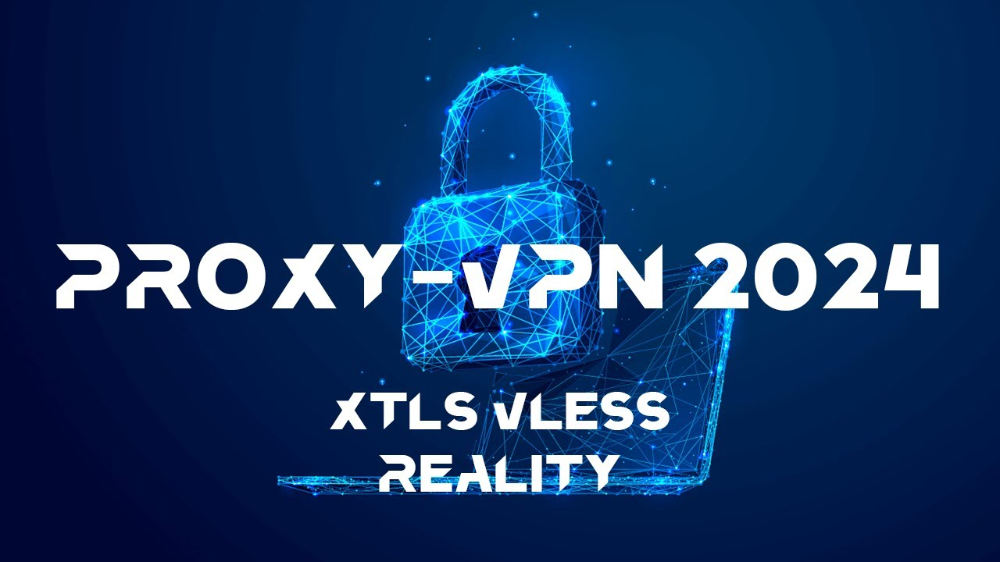

***Оглавление***
- [Вместо введения](Инструкция%20по%20настройке%20своего%20Xray-сервера%20(VLESS%20XTLS-Reality+3X-UI%20на%20VPS)%20в%202024-2025г%20v1.0.md#Вместо%20введения)
- [Теория - понятия, определения и нюансы](Инструкция%20по%20настройке%20своего%20Xray-сервера%20(VLESS%20XTLS-Reality+3X-UI%20на%20VPS)%20в%202024-2025г%20v1.0.md#Теория%20-%20понятия,%20определения%20и%20нюансы)
	- [Теория (1/4) - Что такое VPS, прокси, VPN, что будем настраивать?](Инструкция%20по%20настройке%20своего%20Xray-сервера%20(VLESS%20XTLS-Reality+3X-UI%20на%20VPS)%20в%202024-2025г%20v1.0.md#%D0%A2%D0%B5%D0%BE%D1%80%D0%B8%D1%8F%20(1/4)%20-%20%D0%A7%D1%82%D0%BE%20%D1%82%D0%B0%D0%BA%D0%BE%D0%B5%20VPS,%20%D0%BF%D1%80%D0%BE%D0%BA%D1%81%D0%B8,%20VPN,%20%D1%87%D1%82%D0%BE%20%D0%B1%D1%83%D0%B4%D0%B5%D0%BC%20%D0%BD%D0%B0%D1%81%D1%82%D1%80%D0%B0%D0%B8%D0%B2%D0%B0%D1%82%D1%8C?)
	- [Теория (2/4) - Что такое XRay/VLESS/XTLS-Reality/3X-UI и прочее?](Инструкция%20по%20настройке%20своего%20Xray-сервера%20(VLESS%20XTLS-Reality+3X-UI%20на%20VPS)%20в%202024-2025г%20v1.0.md#%D0%A2%D0%B5%D0%BE%D1%80%D0%B8%D1%8F%20(2/4)%20-%20%D0%A7%D1%82%D0%BE%20%D1%82%D0%B0%D0%BA%D0%BE%D0%B5%20XRay/VLESS/XTLS-Reality/3X-UI%20%D0%B8%20%D0%BF%D1%80%D0%BE%D1%87%D0%B5%D0%B5?)
	- [Теория (3/4) - Понятия и нюансы работы клиентских приложений](Инструкция%20по%20настройке%20своего%20Xray-сервера%20(VLESS%20XTLS-Reality+3X-UI%20на%20VPS)%20в%202024-2025г%20v1.0.md#%D0%A2%D0%B5%D0%BE%D1%80%D0%B8%D1%8F%20(3/4)%20-%20%D0%9F%D0%BE%D0%BD%D1%8F%D1%82%D0%B8%D1%8F%20%D0%B8%20%D0%BD%D1%8E%D0%B0%D0%BD%D1%81%D1%8B%20%D1%80%D0%B0%D0%B1%D0%BE%D1%82%D1%8B%20%D0%BA%D0%BB%D0%B8%D0%B5%D0%BD%D1%82%D1%81%D0%BA%D0%B8%D1%85%20%D0%BF%D1%80%D0%B8%D0%BB%D0%BE%D0%B6%D0%B5%D0%BD%D0%B8%D0%B9)
	- [Теория (4/4) - Пару слов о безопасности](Инструкция%20по%20настройке%20своего%20Xray-сервера%20(VLESS%20XTLS-Reality+3X-UI%20на%20VPS)%20в%202024-2025г%20v1.0.md#%D0%A2%D0%B5%D0%BE%D1%80%D0%B8%D1%8F%20(4/4)%20-%20%D0%9F%D0%B0%D1%80%D1%83%20%D1%81%D0%BB%D0%BE%D0%B2%20%D0%BE%20%D0%B1%D0%B5%D0%B7%D0%BE%D0%BF%D0%B0%D1%81%D0%BD%D0%BE%D1%81%D1%82%D0%B8)
- [**Инструкция - настройка протокола VLESS с XTLS-Reality через панель 3X-UI на своём VPS-сервере и клиенте**](Инструкция%20по%20настройке%20своего%20Xray-сервера%20(VLESS%20XTLS-Reality+3X-UI%20на%20VPS)%20в%202024-2025г%20v1.0.md#**Инструкция%20-%20настройка%20протокола%20VLESS%20с%20XTLS-Reality%20через%20панель%203X-UI%20на%20своём%20VPS-сервере%20и%20клиенте**)
	- [Шаг 1. Выбор и покупка VPS/VDS сервера](Инструкция%20по%20настройке%20своего%20Xray-сервера%20(VLESS%20XTLS-Reality+3X-UI%20на%20VPS)%20в%202024-2025г%20v1.0.md#%D0%A8%D0%B0%D0%B3%201.%20%D0%92%D1%8B%D0%B1%D0%BE%D1%80%20%D0%B8%20%D0%BF%D0%BE%D0%BA%D1%83%D0%BF%D0%BA%D0%B0%20VPS/VDS%20%D1%81%D0%B5%D1%80%D0%B2%D0%B5%D1%80%D0%B0)
	- [Шаг 2. Проверка IP-адреса и подключение к серверу](Инструкция%20по%20настройке%20своего%20Xray-сервера%20(VLESS%20XTLS-Reality+3X-UI%20на%20VPS)%20в%202024-2025г%20v1.0.md#%D0%A8%D0%B0%D0%B3%202.%20%D0%9F%D1%80%D0%BE%D0%B2%D0%B5%D1%80%D0%BA%D0%B0%20IP-%D0%B0%D0%B4%D1%80%D0%B5%D1%81%D0%B0%20%D0%B8%20%D0%BF%D0%BE%D0%B4%D0%BA%D0%BB%D1%8E%D1%87%D0%B5%D0%BD%D0%B8%D0%B5%20%D0%BA%20%D1%81%D0%B5%D1%80%D0%B2%D0%B5%D1%80%D1%83)
	- [Шаг 3. Базовая настройка и обеспечение безопасности сервера](Инструкция%20по%20настройке%20своего%20Xray-сервера%20(VLESS%20XTLS-Reality+3X-UI%20на%20VPS)%20в%202024-2025г%20v1.0.md#%D0%A8%D0%B0%D0%B3%203.%20%D0%91%D0%B0%D0%B7%D0%BE%D0%B2%D0%B0%D1%8F%20%D0%BD%D0%B0%D1%81%D1%82%D1%80%D0%BE%D0%B9%D0%BA%D0%B0%20%D0%B8%20%D0%BE%D0%B1%D0%B5%D1%81%D0%BF%D0%B5%D1%87%D0%B5%D0%BD%D0%B8%D0%B5%20%D0%B1%D0%B5%D0%B7%D0%BE%D0%BF%D0%B0%D1%81%D0%BD%D0%BE%D1%81%D1%82%D0%B8%20%D1%81%D0%B5%D1%80%D0%B2%D0%B5%D1%80%D0%B0)
	- [Шаг 4. Выбор сайта для маскирования](Инструкция%20по%20настройке%20своего%20Xray-сервера%20(VLESS%20XTLS-Reality+3X-UI%20на%20VPS)%20в%202024-2025г%20v1.0.md#%D0%A8%D0%B0%D0%B3%204.%20%D0%92%D1%8B%D0%B1%D0%BE%D1%80%20%D1%81%D0%B0%D0%B9%D1%82%D0%B0%20%D0%B4%D0%BB%D1%8F%20%D0%BC%D0%B0%D1%81%D0%BA%D0%B8%D1%80%D0%BE%D0%B2%D0%B0%D0%BD%D0%B8%D1%8F)
	- [Шаг 5. Установка панели 3-XU (X-UI)](Инструкция%20по%20настройке%20своего%20Xray-сервера%20(VLESS%20XTLS-Reality+3X-UI%20на%20VPS)%20в%202024-2025г%20v1.0.md#%D0%A8%D0%B0%D0%B3%205.%20%D0%A3%D1%81%D1%82%D0%B0%D0%BD%D0%BE%D0%B2%D0%BA%D0%B0%20%D0%BF%D0%B0%D0%BD%D0%B5%D0%BB%D0%B8%203-XU%20(X-UI))
	- [Шаг 6. Настройка VLESS-Reality через панель 3X-UI](Инструкция%20по%20настройке%20своего%20Xray-сервера%20(VLESS%20XTLS-Reality+3X-UI%20на%20VPS)%20в%202024-2025г%20v1.0.md#%D0%A8%D0%B0%D0%B3%206.%20%D0%9D%D0%B0%D1%81%D1%82%D1%80%D0%BE%D0%B9%D0%BA%D0%B0%20VLESS-Reality%20%D1%87%D0%B5%D1%80%D0%B5%D0%B7%20%D0%BF%D0%B0%D0%BD%D0%B5%D0%BB%D1%8C%203X-UI)
	- [Шаг 7. Настройка клиентского приложения (на компьютере и телефоне)](Инструкция%20по%20настройке%20своего%20Xray-сервера%20(VLESS%20XTLS-Reality+3X-UI%20на%20VPS)%20в%202024-2025г%20v1.0.md#Шаг%207.%20Настройка%20клиентского%20приложения%20(на%20компьютере%20и%20телефоне))
	- [Шаг 8. Настройка дополнительных плюшек (опционально)](Инструкция%20по%20настройке%20своего%20Xray-сервера%20(VLESS%20XTLS-Reality+3X-UI%20на%20VPS)%20в%202024-2025г%20v1.0.md#Шаг%208.%20Настройка%20дополнительных%20плюшек%20(опционально)) (to do...)
	- [Шаг X - Что можно улучшить?](Инструкция%20по%20настройке%20своего%20Xray-сервера%20(VLESS%20XTLS-Reality+3X-UI%20на%20VPS)%20в%202024-2025г%20v1.0.md#%D0%A8%D0%B0%D0%B3%20X%20-%20%D0%A7%D1%82%D0%BE%20%D0%BC%D0%BE%D0%B6%D0%BD%D0%BE%20%D1%83%D0%BB%D1%83%D1%87%D1%88%D0%B8%D1%82%D1%8C?)
- [Инструкция для тех, кто спешит](Инструкция%20по%20настройке%20своего%20Xray-сервера%20(VLESS%20XTLS-Reality+3X-UI%20на%20VPS)%20в%202024-2025г%20v1.0.md#Инструкция%20для%20тех,%20кто%20спешит) (to do...)
- [В Заключение](Инструкция%20по%20настройке%20своего%20Xray-сервера%20(VLESS%20XTLS-Reality+3X-UI%20на%20VPS)%20в%202024-2025г%20v1.0.md#В%20Заключение)
- [Используемые источники](Инструкция%20по%20настройке%20своего%20Xray-сервера%20(VLESS%20XTLS-Reality+3X-UI%20на%20VPS)%20в%202024-2025г%20v1.0.md#Используемые%20источники)
- [Приложение 1 - Правила маршрутизации для клиента](Инструкция%20по%20настройке%20своего%20Xray-сервера%20(VLESS%20XTLS-Reality+3X-UI%20на%20VPS)%20в%202024-2025г%20v1.0.md#Приложение%201%20-%20Правила%20маршрутизации%20для%20клиента)
- [Приложение 2 - Содержимое файла с настройками маршрутов и конфигурации приложения Nekobox для Android](Инструкция%20по%20настройке%20своего%20Xray-сервера%20(VLESS%20XTLS-Reality+3X-UI%20на%20VPS)%20в%202024-2025г%20v1.0.md#Приложение%202%20-%20Содержимое%20файла%20с%20настройками%20маршрутов%20и%20конфигурации%20приложения%20Nekobox%20для%20Android)

# Инструкцию смотри в [pdf](https://github.com/EmptyLibra/Configure-Xray-with-VLESS-Reality-on-VPS-server/blob/master/%D0%98%D0%BD%D1%81%D1%82%D1%80%D1%83%D0%BA%D1%86%D0%B8%D1%8F%20%D0%BF%D0%BE%20%D0%BD%D0%B0%D1%81%D1%82%D1%80%D0%BE%D0%B9%D0%BA%D0%B5%20%D1%81%D0%B2%D0%BE%D0%B5%D0%B3%D0%BE%20Xray-%D1%81%D0%B5%D1%80%D0%B2%D0%B5%D1%80%D0%B0%20(VLESS%20XTLS-Reality%2B3X-UI%20%D0%BD%D0%B0%20VPS)%20%D0%B2%202024-2025%D0%B3%20v1.0.pdf) или [md](https://github.com/EmptyLibra/Configure-Xray-with-VLESS-Reality-on-VPS-server/blob/master/%D0%98%D0%BD%D1%81%D1%82%D1%80%D1%83%D0%BA%D1%86%D0%B8%D1%8F%20%D0%BF%D0%BE%20%D0%BD%D0%B0%D1%81%D1%82%D1%80%D0%BE%D0%B9%D0%BA%D0%B5%20%D1%81%D0%B2%D0%BE%D0%B5%D0%B3%D0%BE%20Xray-%D1%81%D0%B5%D1%80%D0%B2%D0%B5%D1%80%D0%B0%20(VLESS%20XTLS-Reality%2B3X-UI%20%D0%BD%D0%B0%20VPS)%20%D0%B2%202024-2025%D0%B3%20v1.0.md) файле (скачивайте их себе для корректного отображения!)
