***Оглавление***
- [Вместо введения](#Вместо%20введения)
- [Теория - понятия, определения и нюансы](#Теория%20-%20понятия,%20определения%20и%20нюансы)
	- [Теория (1/4) - Что такое VPS, прокси, VPN, что будем настраивать?](#%D0%A2%D0%B5%D0%BE%D1%80%D0%B8%D1%8F%20(1/4)%20-%20%D0%A7%D1%82%D0%BE%20%D1%82%D0%B0%D0%BA%D0%BE%D0%B5%20VPS,%20%D0%BF%D1%80%D0%BE%D0%BA%D1%81%D0%B8,%20VPN,%20%D1%87%D1%82%D0%BE%20%D0%B1%D1%83%D0%B4%D0%B5%D0%BC%20%D0%BD%D0%B0%D1%81%D1%82%D1%80%D0%B0%D0%B8%D0%B2%D0%B0%D1%82%D1%8C?)
	- [Теория (2/4) - Что такое XRay/VLESS/XTLS-Reality/3X-UI и прочее?](#%D0%A2%D0%B5%D0%BE%D1%80%D0%B8%D1%8F%20(2/4)%20-%20%D0%A7%D1%82%D0%BE%20%D1%82%D0%B0%D0%BA%D0%BE%D0%B5%20XRay/VLESS/XTLS-Reality/3X-UI%20%D0%B8%20%D0%BF%D1%80%D0%BE%D1%87%D0%B5%D0%B5?)
	- [Теория (3/4) - Понятия и нюансы работы клиентских приложений](#%D0%A2%D0%B5%D0%BE%D1%80%D0%B8%D1%8F%20(3/4)%20-%20%D0%9F%D0%BE%D0%BD%D1%8F%D1%82%D0%B8%D1%8F%20%D0%B8%20%D0%BD%D1%8E%D0%B0%D0%BD%D1%81%D1%8B%20%D1%80%D0%B0%D0%B1%D0%BE%D1%82%D1%8B%20%D0%BA%D0%BB%D0%B8%D0%B5%D0%BD%D1%82%D1%81%D0%BA%D0%B8%D1%85%20%D0%BF%D1%80%D0%B8%D0%BB%D0%BE%D0%B6%D0%B5%D0%BD%D0%B8%D0%B9)
	- [Теория (4/4) - Пару слов о безопасности](#%D0%A2%D0%B5%D0%BE%D1%80%D0%B8%D1%8F%20(4/4)%20-%20%D0%9F%D0%B0%D1%80%D1%83%20%D1%81%D0%BB%D0%BE%D0%B2%20%D0%BE%20%D0%B1%D0%B5%D0%B7%D0%BE%D0%BF%D0%B0%D1%81%D0%BD%D0%BE%D1%81%D1%82%D0%B8)
- [**Инструкция - настройка протокола VLESS с XTLS-Reality через панель 3X-UI на своём VPS-сервере и клиенте**](#**Инструкция%20-%20настройка%20протокола%20VLESS%20с%20XTLS-Reality%20через%20панель%203X-UI%20на%20своём%20VPS-сервере%20и%20клиенте**)
	- [Шаг 1. Выбор и покупка VPS/VDS сервера](#%D0%A8%D0%B0%D0%B3%201.%20%D0%92%D1%8B%D0%B1%D0%BE%D1%80%20%D0%B8%20%D0%BF%D0%BE%D0%BA%D1%83%D0%BF%D0%BA%D0%B0%20VPS/VDS%20%D1%81%D0%B5%D1%80%D0%B2%D0%B5%D1%80%D0%B0)
	- [Шаг 2. Проверка IP-адреса и подключение к серверу](#%D0%A8%D0%B0%D0%B3%202.%20%D0%9F%D1%80%D0%BE%D0%B2%D0%B5%D1%80%D0%BA%D0%B0%20IP-%D0%B0%D0%B4%D1%80%D0%B5%D1%81%D0%B0%20%D0%B8%20%D0%BF%D0%BE%D0%B4%D0%BA%D0%BB%D1%8E%D1%87%D0%B5%D0%BD%D0%B8%D0%B5%20%D0%BA%20%D1%81%D0%B5%D1%80%D0%B2%D0%B5%D1%80%D1%83)
	- [Шаг 3. Базовая настройка и обеспечение безопасности сервера](#%D0%A8%D0%B0%D0%B3%203.%20%D0%91%D0%B0%D0%B7%D0%BE%D0%B2%D0%B0%D1%8F%20%D0%BD%D0%B0%D1%81%D1%82%D1%80%D0%BE%D0%B9%D0%BA%D0%B0%20%D0%B8%20%D0%BE%D0%B1%D0%B5%D1%81%D0%BF%D0%B5%D1%87%D0%B5%D0%BD%D0%B8%D0%B5%20%D0%B1%D0%B5%D0%B7%D0%BE%D0%BF%D0%B0%D1%81%D0%BD%D0%BE%D1%81%D1%82%D0%B8%20%D1%81%D0%B5%D1%80%D0%B2%D0%B5%D1%80%D0%B0)
	- [Шаг 4. Выбор сайта для маскирования](#%D0%A8%D0%B0%D0%B3%204.%20%D0%92%D1%8B%D0%B1%D0%BE%D1%80%20%D1%81%D0%B0%D0%B9%D1%82%D0%B0%20%D0%B4%D0%BB%D1%8F%20%D0%BC%D0%B0%D1%81%D0%BA%D0%B8%D1%80%D0%BE%D0%B2%D0%B0%D0%BD%D0%B8%D1%8F)
	- [Шаг 5. Установка панели 3-XU (X-UI)](#%D0%A8%D0%B0%D0%B3%205.%20%D0%A3%D1%81%D1%82%D0%B0%D0%BD%D0%BE%D0%B2%D0%BA%D0%B0%20%D0%BF%D0%B0%D0%BD%D0%B5%D0%BB%D0%B8%203-XU%20(X-UI))
	- [Шаг 6. Настройка VLESS-Reality через панель 3X-UI](#%D0%A8%D0%B0%D0%B3%206.%20%D0%9D%D0%B0%D1%81%D1%82%D1%80%D0%BE%D0%B9%D0%BA%D0%B0%20VLESS-Reality%20%D1%87%D0%B5%D1%80%D0%B5%D0%B7%20%D0%BF%D0%B0%D0%BD%D0%B5%D0%BB%D1%8C%203X-UI)
	- [Шаг 7. Настройка клиентского приложения (на компьютере и телефоне)](#Шаг%207.%20Настройка%20клиентского%20приложения%20(на%20компьютере%20и%20телефоне))
	- [Шаг 8. Настройка дополнительных плюшек (опционально)](#Шаг%208.%20Настройка%20дополнительных%20плюшек%20(опционально)) (to do...)
	- [Шаг X - Что можно улучшить?](#%D0%A8%D0%B0%D0%B3%20X%20-%20%D0%A7%D1%82%D0%BE%20%D0%BC%D0%BE%D0%B6%D0%BD%D0%BE%20%D1%83%D0%BB%D1%83%D1%87%D1%88%D0%B8%D1%82%D1%8C?) 
- [Инструкция для тех, кто спешит](#Инструкция%20для%20тех,%20кто%20спешит) (to do...)
- [В Заключение](#В%20Заключение)
- [Используемые источники](#Используемые%20источники)
- [Приложение 1 - Правила маршрутизации для клиента](#Приложение%201%20-%20Правила%20маршрутизации%20для%20клиента)
- [Приложение 2 - Содержимое файла с настройками маршрутов и конфигурации приложения Nekobox для Android](#Приложение%202%20-%20Содержимое%20файла%20с%20настройками%20маршрутов%20и%20конфигурации%20приложения%20Nekobox%20для%20Android)

---

# Вместо введения
Данная инструкция позволит вам самостоятельно настроить свой VPS-сервер на обход всех Российских (и не только) блокировок и получить доступ к таким ресурсам, как YouTube, Twitter (X), Instagram, Discord, ChatGPT и многому другому. В отличие от обычного платного или бесплатного VPN, у этого решения есть несколько плюсов:
- [p] ***Ваши данные будут в безопасности***
  Вы точно знаете, что за вашим трафиком никто не наблюдает и не отправляет третьим лицам (при грамотной настройке и соблюдении всех советов по безопасности), ведь сервер будет полностью настраиваться вами (VPN, особенно бесплатные, не могут вам этого гарантировать);
- [p] ***Можно управлять маршрутизацией трафика***
  Данные будут отправляться через ваш VPS-сервер, настроенный как прокси-сервер, что позволяет управлять настройками маршрутизации не только на клиенте, но и на сервере;
- [p] ***Очень гибкая настройка маршрутизации***
  Вы сможете тонко настраивать правила маршрутизации трафика вплоть до отдельных процессов/приложений и сайтов. Это позволит отправлять через прокси-сервер запросы на те ресурсы, которые либо заблокированы в РФ, либо находятся за рубежом. Однако трафик к российским сайтам и ресурсам по-прежнему будет отправляться напрямую, что добавит безопасности вашему VPS-серверу;
- [p] ***Большая устойчивость к блокировкам***
  Все данные, как и в случае с VPN будут передаваться зашифрованными, но по необычному протоколу VLESS, устойчивому к блокировкам и выявлению VPN/Proxy трафика (благодаря его расширениям, таким как uTLS, XTLS-Vision и XTLS-Reality). Его разработали наши Китайские коллеги, у которых дела с интернет цензурой обстоят гораздо хуже. Данный протокол маскируется под трафик от обычных WEB-сайтов (HTTPS), что делает его весьма незаметным;
- [p] ***Устойчивость к блокировкам на долго (скорее всего)***
  Пока нет достоверных свидетельств того, что протокол VLESS XTLS-Reality умеют достоверно распознавать и блокировать. Поэтому этот протокол прослужит, по крайней мере, несколько лет, и при необходимости его можно будет обновить.
  Увы, никто не может гарантировать, что какой-нибудь Роскомнадзор не изобретёт инновационные методы блокировки трафика, хотя борьба тех, кто хочет ограничить свободу нашего интернета и тех, кто пытается нас освободить, никогда не закончится!
- [p] ***Вы узнаете много нового и получите ценный опыт (надеюсь)***
  В разделе теории вы сможете кратко ознакомиться с технической стороной вопроса и узнать как это работает, а благодаря ссылкам, приведённым в разделе "Используемые источники", вы сможете узнать много нового о других современных технологиях и способах обхода блокировок! Учитывая, что операционная система Linux (AstraLinux) может стать повсеместно распространена в случае усиления санкций/блокировок, это отличный способ познакомиться с ней немного ближе)

Однако есть и минусы:
- [c] ***Деньги...***
  Вам потребуется арендовать зарубежный VPS-сервер, что потребует от вас 200-500 р в месяц, но свободный интернет того стоит!
- [c] ***Настройка может оказаться сложной***
  Настройка такого протокола потребует от вас настройки не только клиентской, но и серверной стороны (да, Linux, да немного консоли). Однако я описал всё довольно подробно, а большая часть настроек самого VLESS делается через графический интерфейс браузера. Тем более, что основные настройки через консоль будут относиться скорее к безопасности сервера, чем к протоколу VLESS;
- [c] ***Что-то может пойти не так не из-за вас***
  Протокол VLESS для своей маскировки использует сторонний сайт и если с этим сайтом что-то случится, то и ваш прокси перестанет работать. Впрочем, это можно предотвратить, настроив несколько серверов на маскировку под разные сайты или маскироваться под свой собственный сайт;
- [c] ***Будут моменты, когда это не будет работать***
  Ни один VPS-провайдер не гарантирует 100% времени работы своих серверов (впрочем, это не гарантируют и VPN), а потому неизбежно будут возникать ситуации, когда ваш прокси-сервер будет не доступен. Впрочем, аренда ещё одного сервера у другого провайдера почти полностью решает эту проблему.

Вам понадобится:
- Пара-тройка вечеров свободного времени (зависит от ваших знаний и опыта);
- Немного усердия и желания разобраться, а не просто быстро всё настроить;
- 200-500 рублей в месяц на аренду VPS-сервера;
- ПК с доступом в интернет для удалённой настройки сервера.

*Статья написана в приложении для заметок [Obsidian](https://obsidian.md/) v1.5.12 и затем конвертирована в pdf. Желающие могут скачать её отсюда в исходном виде, написанном на языке Markdown (файл формата .md). Большинство статей, указанных в "используемых источниках" уже не доступна у нас, так что вы можете скачать и прочитать их с [моей страницы](https://github.com/EmptyLibra/Configure-Xray-with-VLESS-Reality-on-VPS-server) на Github.*

---

# Теория - понятия, определения и нюансы
> [!Warning]+ Примечания
> *Я настоятельно рекомендую прочитать все разделы теории, чтобы иметь хотя бы базовое представление о том, с чем вы собираетесь работать и как это будет работать. Это позволит вам не допускать банальных ошибок и, при желании, обдуманно вносить правки и решать возникающие проблемы. Хоть я и старался избегать специальных терминов, их здесь достаточно много, так что будет вполне нормально, если содержимое уложится у вас не с первого раза.*

## Теория (1/4) - Что такое VPS, прокси, VPN, что будем настраивать?
> [!NOTE]+ Что такое VPS/VDS сервер?
> **VPS (virtual private server)/ VDS (virtual dedicated server), виртуальный выделенный сервер** - вид сервера, привилегированный доступ к которому клиент получает с помощью удалённого соединения (например, SSH). В плане управления операционной системой по большей части соответствует физическому выделенному серверу и часто предоставляется с выделенным IPv4 или IPv6 адресом. Обычно, сервер представляет собой виртуальную машину, запущенную на физическом сервере по средством технологий KVM, Xen, Hyper-V, VMWare и других. VPS и VDP в наши дни являются синонимами.
> Такой сервер арендуется у специальных облачных провайдеров/хостеров на заданный период времени. При его аренде можно выбрать произвольное кол-во ядер процессора, ОЗУ, дискового пространства и других характеристик, которые в будущем можно, при желании, расширить. Провайдеры предоставляют дополнительные опции, такие как защиту от DDOS-атак, резервное копирование, техническую поддержку и прочее. Также хостеры отличаются кол-вом интернет трафика, предоставляемого за месяц. Лучше всего, когда он безлимитный.

> [!NOTE]+ Что такое прокси-сервер и чем он отличается от VPN?
> **Прокси-сервер или сервер-посредник** - промежуточной сервер, выполняющий роль посредника между пользователем и целевым сервером (в нашем случае между вами и зарубежным интернетом), позволяющий клиентам как выполнять косвенные запросы (принимая и передавая их через прокси-сервер) к другим сетевым службам, так и получать ответы. Мы будем настраивать именно прокси-сервер, который будет располагаться за рубежом и через него получать доступ ко всем заблокированным ресурсам.
> 
> **VPN** (virtual private network — «виртуальная частная сеть») - обобщённое название технологий, позволяющих организовать соединение между несколькими устройствами поверх сети интернет так, будто бы они находятся в одной локальной сети (например, подключены к одному Wi-Fi). Между узлами устанавливается зашифрованный туннель, по которому безопасно передаются пакеты данных.
> 
> Обычно, прокси-сервер просто перенаправляет трафик и не шифрует его, а VPN зашифровывает весь трафик от одного узла до другого. Однако мы будем использовать специальный протокол, который имеет встроенное шифрование и прокси сервер, перенаправляющий наш трафик на необходимые нам сайты, так что в этом плане наше подключение будет мало чем отличаться от VPN, но поскольку, у нас именно прокси, то ПК, подключённые к нашему прокси-серверу не будут объединены в одну локальную сеть.
> Также прокси позволит нам осуществлять очень гибкую настройку исходящего трафика и проксировать трафик только от необходимых приложений, а всё остальное пускать напрямую в интернет без прокси, в том время как VPN обычно шифрует и направляет через себя весь исходящий трафик. 

Теперь, разберёмся с тем, что мы, собственно, будем делать. Схематично это изображено на картинке ниже.
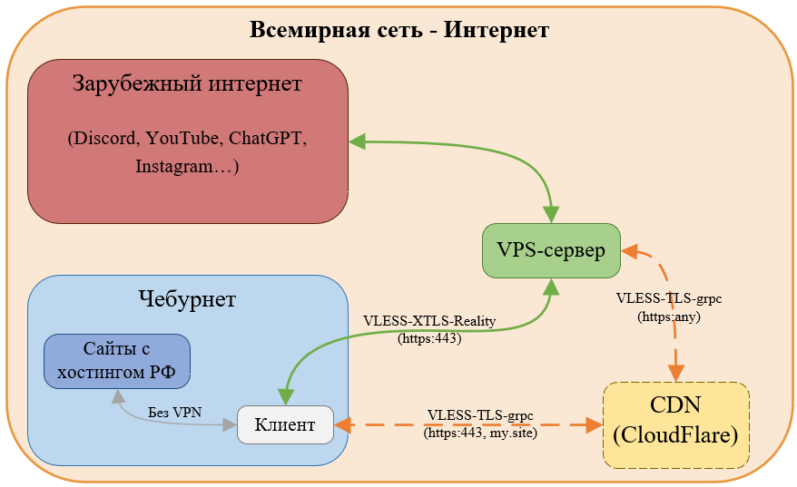
- Мы (клиент) будем проксировать (направлять) через VPS-сервер трафик только для тех приложений/сайтов, которые заблокированы в РФ и им нужен будет доступ в зарубежный интернет. Логично, что VPS-сервер должен находиться за рубежом и желательно в той стране, где нам доступно всё, что требуется (discord, youtube, chatgpt,...).
- В свою очередь, доступ к сайтам и приложениям, расположенным в РФ мы будем осуществлять напрямую, чтобы лишний раз не нагружать VPS-сервер и чтобы не привлечь внимание Роскомнадзора (РКН). Если РКН заметит, что какой-то пакет данных сначала прошёл границу РФ в одну сторону, а затем быстро вернулся обратно и обратился к сайту в РФ, то у него возникнут подозрения, что мы используем прокси и он нас может заблокировать. Это относится не только к сайтам с доменами ".ru", ".su", но и к сотрудничающим с РФ сайтам и сервисам, таким как Yandex, VK, сайты госуслуг, почты и прочее.
- Дополнительной мерой безопасности может служить настройка подключения к серверу через **CDN (Content Delivery Network - сеть доставки содержимого)**. CDN — это географически распределённая сетевая инфраструктура, обеспечивающая быструю доставку контента пользователям веб-сервисов и сайтов. Входящие в состав CDN, cерверы географически располагаются таким образом, чтобы сделать время ответа для пользователей сайта/сервиса минимальным. Можно настроить подключение к серверу через бесплатную общедоступную сеть, вроде CloudFlare, что даст возможность подключиться к серверу, если его вдруг решат заблокировать. Конечно, скорость соединения в такой сети будет не велика. Это лишь дополнительная мера на "чёрный день", ведь вероятность блокировки всей сети CDN маловероятна, но пока мы это настраивать не будем.
- Сервер и клиент будут связываться между собой посредством нового протокола VLESS с расширениями uTLS, XTLS-Vision и XTLS-Reality. Он маскируется под обычный HTTPS трафик и устойчив к блокировкам (если вы соблюдаете ряд правил). На 2024 этот протокол ещё не умеют блокировать ни в РФ, ни в Китае.

> [!NOTE]+ Почему бы не использовать более простые и быстрые протоколы WireGuard/OpenVPN/OutLine/Shadowsocks?
> Дело в том, что эти протоколы не были разработаны устойчивыми к блокировке, поэтому РКН и другие успешно научились их опознавать и блокировать. Более того, сервера, где использовались эти протоколы также запоминаются, и в будущем просто блокируется к ним доступ. Поэтому, используя на своём сервере один из этих протоколов, вы подвергаете его вероятной блокировке в будущем. Различные расширения этих протоколов являются лишь временной мерой и тоже могут быть заблокированы.
> Также не рекомендуется использовать Shadowsocks, в том числе его новые версии, т.к. его трафик тоже научились распознавать и блокировать по соотношению кол-ва 1 и 0 в посылке нейросетями.
> VLESS на данный момент один из немногих протоколов, который пока никто не умеет блокировать целенаправленно.

> [!question]+ Каким образом РКН и другие вычисляют VPN/Proxy трафик и блокируют его?
> Ответив на этот вопрос, мы лучше поймём, какие наши неосторожные действия могут привести к блокировке сервера и чего следует избегать. "По периметру" РФ стоят "чёрные ящики" - оборудование от РКН - "ТСПУ" (Технические Средства Противодействия Угрозам, в Китае это Великий Китайский файрволл GFW), которое анализирует весь проходящий трафик и всё, что РКН считает "угрозой" может быть им заблокировано. Помимо блокировки он умеет и просто замедлять трафик, делая невозможным использование ресурсов/сайтов. В Китае или Иране дела с цензурой обстоят ещё жёстче, именно Китайцы разработали протокол VLESS. Способов обнаружения VPN/Proxy трафика довольно таки много, но вот основные, от более простых к более сложным:
> - Анализ структуры, сигнатур и размеров передаваемых пакетов, особенно в момент установления соединения (давно практикуется Роскомнадзором, для этого и было установлено оборудование ТСПУ). Так заблокировали WireGuard/OpenVPN/OutLine (это основы технологии, называемой Deep Packet Inspection (DPI) - глубокий анализ пакетов);
> - Active probing (активное зондирование): при маскировке протокола под HTTPS (обычный веб‑сайт), цензоры пытаются подключиться к такому «сайту», чтобы проверить, действительно ли там есть настоящий веб‑сервер, а так же используя пути (URL), зарезервированные в VPN‑протоколах для установления соединения, в результате чего сервер себя демаскирует; [есть свидетельства](https://t.me/usher2/3081), что РКН тоже начал заниматься active probing'ом;
> - Анализ TLS fingerprint («отпечатка» — набора поддерживаемых шифров, эллиптических кривых, поддерживаемых расширений протокола, и т. д.) клиента. Отпечатки современных браузеров (Chrome, Firefox, и т. д.) известны, а отпечатки многих VPN‑ и прокси‑клиентов могут от них отличаться, что влечет за собой выявление и блокировку таких клиентов; РКН об этом в курсе, какое‑то время назад он уже пытался [блокировать](https://gitlab.torproject.org/tpo/anti-censorship/pluggable-transports/snowflake/-/issues/40014#note_2765074) Tor‑Snowflake по отпечатку библиотеки [Pion](https://pion.ly/);
> - Детектирование TLS‑inside‑TLS (повторного шифрования) статистическим анализом размеров пакетов;
> - Белые списки протоколов — это когда разрешены подключения только по известным протоколам, которые узнаваемы для оборудования DPI (оно же ТСПУ), а все остальные протоколы блокируются. Если используемый протокол не похож ни на что известное механизму фильтрации, например выглядит как случайная последовательность байтов, то такое соединение блокируется. Имеются свидетельства, что РКН уже применял подобные методы во время волнений в Дагестане в прошлом году, пытаясь заблокировать Telegram (трафик tg‑proxy, не имеет характерных признаков и выглядит как рандомный байтовый поток);
> - Белые списки доменов. Это не обязательно может быть полная блокировка тех доменов, что не в списке, а, например, ограничение скорости ко всем «недоверенным» доменам, либо блокировка доступа к ним после достижения определенного предела объема переданного трафика. Такое в настоящее время применяется в Иране;
> - Черные списки диапазонов IP‑адресов. В Туркменистане, например, этими черными списками забанено больше половины всех адресов интернета. При обнаружении запрещенного контента, VPN или прокси‑сервера на одном IP‑адресе, блокируется целая подсеть.
> - Последний пункт особенно важен и заслуживает особого внимания. Существует известное выражение: «пока гром не грянет, мужик не перекрестится». К сожалению, оно полностью относится и к нашей сегодняшней теме. Многие люди думают «_А, ну пока все работает, а как работать перестанет, тогда я установлю‑перенастрою и решу проблему_». Это очень опасный подход. Допустим, у вас установлен сервер Wireguard или OpenVPN, и пока всё функционирует нормально. Но уже точно известно, что Роскомнадзор на подконтрольном ему оборудовании может детектировать такие подключения. В результате они могут легко начать составлять списки IP‑адресов таких серверов для полной блокировки доступа к ним когда запахнет жареным, например, во время обострения политической жизни в стране, и я более чем уверен, что они уже составляют такие списки. Если вы на таком «отравленном» IP‑адресе потом поднимите какой‑нибудь другой, более надежный и недетектируемый сервис, вы все равно не сможете им пользоваться, ничего не будет работать — останется только арендовать новый виртуальный сервер, и надеяться, что на IP‑адресе, который вам достанется, никто не хулиганил до этого. Если вы не верите, что дело до такого дойдет, то, увы — до такого уже доходило. Пару лет назад РКН искал Tor‑мосты (bridges), запрашивая их с веб‑сайта Tor, прикидываясь обычным пользователем, в результате чего IP‑адреса таких мостов на какое‑то время [блокировались](https://ntc.party/t/ooni-reports-of-tor-blocking-in-certain-isps-since-2021-12-01/1477/5) полностью, не помогала ни смена порта, и даже не удавалось подключиться к серверу по SSH.

## Теория (2/4) - Что такое XRay/VLESS/XTLS-Reality/3X-UI и прочее?
Подробнее разберём, что означают все эти непонятные слова. На заметку: мы будем настраивать и использовать клиент-серверное приложение XRay с протоколом VLESS поверх TCP с расширениями uTLS и XTLS-Reality через удобную графическую панель 3X-UI. Если вам лень читать подробную информацию ниже, то вот кратко:
- XRay - клиент-серверное приложение, с которым вы взаимодействуете по специальному протоколу.
- VLESS - тот самый защищённый от блокировок протокол, маскирующийся под трафик от обычных веб-сайтов (HTTPS) и перенаправляющий ~~РКН~~ недругов к некоторой популярной веб-странице.
	- XTLS-Reality - расширение этого протокола, позволяющее маскироваться под произвольный популярный сайт.
- 3X-UI - графическая оболочка для настройки и редактирования ядра XRay, позволяющее создавать подключения и прочее через удобный интерфейс, а не через консоль.

> [!NOTE]+ Ядра клиент-серверных приложений XRay/Sing-box
> **XRay** (форк (клон) V2Fly (бывший V2Ray)) - это не протокол, а скорее клиент-серверное приложение, поддерживающее множество протоколов, их расширений и способов их транспортировки.  В конфигурации задаются inbounds (обработчики входящих подключений) и outbound (обработчики исходящих подключений).
> Например, уже на клиенте можно автоматически отправлять все запросы к доменам “.ru” и российским IP-адресам согласно базе GeoIP на outbound “freedom” (прямой доступ к интернет без прокси), а все остальное проксировать на удаленный сервер. Или наоборот, по умолчанию отправлять все на freedom, а проксировать только адреса и домены из списка (в том числе с масками и регулярными выражениями). На сервере же эта возможность позволяет блокировать какой-либо трафик (например, рекламу) и принимать подключения по разным протоколам. Поддерживает протоколы Shadowsocks, VMess, VLESS, Trojan, все это с транспортами TLS с uTLS, Websockets, gRPC и mKCP.
> 
> **Sing-box** - относительно новое мультипротокольное клиент-серверное ядро. Как и V2Ray/XRay может работать и как клиент, и как сервер, поддерживает Shadowsocks, VMess, VLess, Hysteria, Trojan, и даже Tor, Wireguard и SSH. 

> [!NOTE]+ Защищённый протокол VLESS и его расширения
> VLESS - новый защищённый протокол (его предшественник VMess), обычно разворачиваемый поверх протокола TLS (который используется с любыми HTTPS-сайтами). VLESS не шифрует трафик, т.к. подразумевается, что шифрованием занимается TLS, вместо этого он шифрует только проверку “свой/чужой” и паддинг данных (изменение размеров пакетов для затруднения детектирования паттернов траффика). Протокол VLESS, как и многие другие, может "транспортироваться" другими различными интернет протоколами (поддерживать разные режимы передачи данных) для своего маскирования и защиты от детектирования. Некоторые возможные транспортерные протоколы:
> - TCP - не имеет смысла, т.к. в таком случае трафик не будет зашифрован. Однако используется с расширением Reality, т.к. оно задействует TLS.
> - TLS - устанавливает обычное TLS-подключение (как и в случае с любыми HTTPS-сайтами), а уже внутри этого зашифрованного соединения работает протокол.
> - mKCP, QUIC или gRPC - менее популярные транспортные протоколы, часть из которых научились блокировать.
> - Websockets - веб‑сокеты часто используются для доступа к прокси‑серверу через популярные CDN (сети доставки контента), такие как Cloudflare или Amazon Cloudfront, что является хорошим запасным вариантом, если вдруг ваш сервер попадет под блокировку. А также позволяет пролезть через строгие корпоративные фаерволы и добавляет дополнительный уровень защиты.
> - **HTTPUpgrade** - по сути дела, те же вебсокеты, но с небольшим упрощением для более эффективной передачи.
> - **SplitTunnel** - вариант транспорта поверх "простого" HTTP для пролезания через CDN.
> - Однако, из-за совокупности факторов, о которых будет сказано немногим позже, для REALITY рекомендуется использовать TCP как единственный надежный режим передачи данных.
> 
> Помимо этого, VLESS имеет несколько расширений, усиливающих его защиту и улучшающих его работу:
> - **uTLS** — предназначена для обмана механизма детектирования на основе TLS fingerprin (цифрового отпечатка), изменяет TLS‑fingerprint клиента; например, можно заставить выглядеть исходящие подключения как подключения от браузеров Chrome, Firefox, Safari, или вообще генерировать каждый раз новый случайный отпечаток.
> - **XUDP** — специальное расширение для передачи UDP‑пакетов через прокси, реализует полный Full Cone NAT с сохранением номера порта. Без этого расширения в некоторых случаях могут не работать аудио‑видео‑звонки в месседжерах, оно было создано именно для решения этой проблемы;
> - **XTLS** - расширение, позволяющее убрать излишнее шифрование. Сегодня почти что все веб-сайты работают не через голый HTTP, а через HTTPS (TLS). Используя прокси с TLS мы, по сути дела, еще раз шифруем уже зашифрованные данные. Во-первых это неэффективно, а во-вторых, что гораздо хуже - китайские цензоры научились определять TLS-inside-TLS (возможно с помощью нейросетей). Суть проста: прокси-сервер подслушивает передаваемый трафик, и если видит, что  между клиентом (например, браузером) и удаленным хостом (например, веб-сервером) устанавливается TLS-соединение, то дожидается окончания хендшейка, и после чего перестает шифровать трафик, начиная передавать пакеты данных “как есть”. В итоге существенно снижается нагрузка на прокси-сервер и клиент, и что важнее - со стороны трафик выглядит гораздо менее подозрительно. XTLS имеет несколько разных версий, которые отличаются алгоритмами работы.
> 	- xtls-rprx-origin и xtls-rprx-direct - самые первые из них (устарели).
> 	- xtls-rprx-splice - задействован механизм ядра Linux splice для более эффективного копирования данных между сокетами (устарел).
> 	- **XTLS-Vision** (xtls-rprx-vision) - современная версия, убирающая лишнее шифрование и защищающая протокол от определения TLS-inside-TLS. Требует наличия доменного имени и сайта для маскировки.
> 	- **XTLS-Reality** - представляет собой усовершенствование существующих технологий TLS, реализуя полный TLS 1.3, самое новое изобретение от авторов XRay, часто работает в паре с XTLS-Vision. В отличие от всех остальных вариантов, определение “свой/чужой” здесь происходит еще на этапе TLS-хендшейка в момент чтения ClientHello. Если клиент опознан как “свой”, сервер работает как прокси, а если нет - вжух! - и TLS подключение передается на какой-нибудь другой абсолютно реальный хост с TLS (например, google.com или gosuslugi.ru), и таким образом клиент (или цензор, желающий методом active probing проверить, а что же прячется на том конце) получит настоящий TLS-сертификат от google.com или gosuslugi.ru и настоящие данные с этого сервера. Полное соответствие.

> [!info]+ На заметку
> Помимо VLESS существуют и другие защищённые протоколы, такие как **Trojan**, **Cloak**, **ShadowTLS**, **Hysteria/Hysteria2**, **mKCP** и прочие...

> [!NOTE]+ Графическая панель 3X-UI
> **X‑UI, 3X‑UI, Marzban, Hiddify** — так называемые «панели», веб‑интерфейсы для прокси‑серверов. В их основе чаще всего используется тот же самый XRay. Изначально задуманы как более простой в установке и настройке вариант сервера для неподкованных пользователей. 3X-UI - легко устанавливается в Docker, сразу на английском с возможностью переключения на русский, имеет в себе все что надо - и главное, работает!
> 
> Однако, эти панели при неправильном управлении добавляют множество уязвимостей и могут привести к блокировке. Хоть в этой инструкции я и привожу пример настройки через панель 3X-UI и стараюсь её обезопасить, всё же рекомендую настраивать XRay напрямую через консоль. Пример можно посмотреть в [этой статье](https://habr.com/ru/articles/799751/) на Хабр.

В итоге, протокол VLESS с XTLS-Reality защищён от следующих атак:
- Прямого обнаружения по сопоставлению с известными VPN-протоколами, такими как Wireguard, OpenVPN, L2TP/IPSec, и даже SoftEther VPN.
	- В том числе, с помощью расширения Reality маскируя трафик под известный и разрешённый зашифрованный TLS протокол, пропускаемый всеми ТСПУ РКНа. Например, Shadowsocks пострадал именно из-за того, что был не похож ни на что другое.
- Расширение Reality защищает нас от _активного зондирования_ ([active probing](https://ensa.fi/active-probing/)) - РКН, видя, что клиент обращается к какому-то забугорному серверу, сам обращается к нему как клиент и смотрит, что находится по этому адресу и что ему отвечают. Если он понимает, что это прокси-сервер, то блокирует нам к нему доступ. Однако Reality нелегальным/неизвестным клиентам подсовывает сайт, под который мы маскируемся, что защищает нас от такого вида атак.
- XTLS-Vision (xtls-rprx-vision) обеспечивает защиту от выявления туннелирования трафика нейросетями (детектирования двойного шифрования TLS-inside-TLS), убирая лишний слой шифрования после успешного рукопожатия.
- Расширение uTLS защищает нас от детектирования на основе TLS fingerprint (цифровых отпечатков), подставляя популярный или случайный отпечаток TLS.
- И многого другого...

## Теория (3/4) - Понятия и нюансы работы клиентских приложений
После того, как мы настроим всё на стороне сервера, придёт время настраивать клиентское приложение на ваших устройствах (ПК, телефоны, планшеты), они имеют очень широкие настройки маршрутизации и позволяют проксировать (отправлять на прокси) трафик только от определённых процессов/приложений/сайтов и настраивать исключения (например, для ru сайтов). Как пример, в клиенте могут быть настроены следующие правила:
- Анализировать трафик только от браузера и Discord:
	- Трафик на российские ресурсы — напрямую (`direct`)
	- Трафик на зарубежные ресурсы — через VPS (`proxy`)
	- Рекламный трафик — блокируется (`block`)
- От клиента трафик поступает на входящие (inbounds) подключения сервера Xray на вашем VPS-сервере и там дополнительно маршрутизируется уже своим модулем маршрутизации (routing):
	- Поскольку сервер находится за пределами РФ, трафик по умолчанию идёт напрямую, что позволяет получить доступ к заблокированным ресурсам (`direct`).
	- При необходимости можно настроить перенаправление трафика на другие VPS (proxy).
	- На сервере также можно блокировать нежелательный трафик, например, рекламу, торренты или ошибочный трафик в сторону РФ (`block`).

Есть несколько понятий, которые я буду использовать в дальнейшем в инструкции по настройке клиентского приложения:
- **Routing** или **Policies** - правила маршрутизации, правила, по которым трафик пользователя будет отправляться на прокси или уходить в интернет напрямую. Например, клиент может автоматически отправлять все запросы к доменам “.ru” и российским IP-адресам согласно базе GeoIP в интернет напрямую, а все остальное выпускать наружу через прокси-сервер. Или наоборот, по умолчанию отправять все напрямую, а проксировать только адреса и домены из списка (в том числе с масками и регулярными выражениями). База GeoIP (принадлежности IP-адресов той или иной стране) нередко поставляется вместе с самим клиентом и ее желательно периодически обновлять.
- **Share link, share QR** - многие мультипротокольные клиенты позволяют делиться настройками с помощью “ссылок” или QR-кодов. “Ссылка” обычно представляет собой URL начинающийся с ss:// (для Shadowsocks), vmess:// (для VMess), vless:// (для VLESS) и т.д., где дальше следует закодированная в base64 JSON-структура с данными для подключения. Соответственно, можно сгенерировать такую ссылку из настроек какого-нибудь клиента, переслать ее на другое устройство или другому человеку, вставить ее в другой клиент и получить там настройки для подключения к этому серверу. QR - примерно то же самое, но не в виде ссылки с base64, а в виде QR кода, который можно сканировать камерой с экрана. Это в теории. Проблема в том, что во-первых существует несколько разных форматов ссылок (формат [SIP002](https://shadowsocks.org/guide/sip002.html), формат Clash, формат Sing-box), и даже при кодировании одним и тем же форматом среди данных могут оказаться поля, которые знает один клиент и не знает другой. Поэтому иногда может случиться так, что скопипастив ссылку или отсканировав QR в клиенте вы получите данные конфигурации нового сервера, но некоторые поля будут пустые. Например, часто теряется поле uTLS fingerprint, **поэтому будьте внимательны**.
- **Subscriptions** (подписки) - многие клиенты умеют автоматически подгружать список серверов откуда-нибудь. Например, вы настроили сервер для своих друзей и родственников. Через какое-то время вы можете поднять на нем новый более защищенный протокол, или перехостить сервер его на другом домене, или еще что. Чтобы не рассылать ссылки/QR-коды вручную вместе с инструкциями о том, как их правильно импортировать, можно просто всем желающим в клиенте вбить URL по которому лежит файл с описанием подключений, и клиент сможет автоматически либо по запросу подтягивать обновления и новые настройки. Правда, тут проблема та же, что и в прошлом пункте - существует несколько разных форматов подписок, например [SIP008](https://shadowsocks.org/guide/sip008.html), формат Clash, формат V2RayN (по сути дела список URL’ов из предыдущего пункта, по одному на строку, и весь файл  еще раз закодирован в base64), [OpenOnlineConfig](https://github.com/Shadowsocks-NET/OpenOnlineConfig), и т.д. Существуют всякие онлайн-конвертеры для преобразования из одного в другой, но работают они так себе, а иногда вообще не работают.
- **Режимы "системный прокси" и TUN / VPN** - клиенты обычно могут работать в двух режимах:
	- Первый режим “системный прокси” - клиент просто прослушивает трафик, идущий через какой-нибудь локальный порт (например 10080 или 2080), а в системе или в браузере настраивается адрес прокси-сервера 127.0.0.1:10080. Клиент перехватывает весь трафик и маршрутизирует его в соответствии со своими правилами. Это самая простая и надежная схема, однако есть два недостатка:
		- Первый состоит в том, что некоторые приложения определяют доменные имена (DNS) сами, еще до отправки запроса на прокси, что может привести к тому, что называется “DNS-утечка” (ваш провайдер узнает, на какие сайты вы ходили, и может даже прислать фейковый ответ ради блокировки неугодного ресурса).
		- Второй недостаток похож на первый, но еще более критичный: некоторые приложения тупо игнорируют настройки системного прокси, либо не умеют работать через прокси вообще. Поэтому разработчики придумали второй режим, обычно называемый TUN.
	- Второй режим "TUN/VPN" - в системе создается виртуальный сетевой интерфейс с каким-нибудь фейковым IP-адресом и маршрут по умолчанию для всей системы настраивается именно через него. Таким образом все TCP и UDP подключения от всех приложений в системе попадают на этот сетевой интерфейс, а далее специальный драйвер перенаправляет их на локальный SOCKS-прокси. Такой режим еще иногда называют “VPN”, хотя по факту он не имеет к VPN никакого отношения :)
	- Некоторые клиенты также могут работать и в смешанном (mixed) режиме, используя оба режима сразу для разных приложений. Часто это позволяет выиграть в скорости работы приложений.
- **IPv6** - многие клиенты поддерживают IPv6, многие серверы тоже (единственный нюанс - если вы запускаете его из Docker, то там не все так просто и для работы IPv6 может понадобиться настроить контейнер на использование host network). Но если вы используете упомянутый в предыдущем абзаце TUN-режим, то нужно быть внимательными. Если клиент не поддерживает IPv6 или IPv6 отключен в его настройках (а нередко он по умолчанию отключен), а ваш провайдер предоставляет вам IPv6-связность, то есть неиллюзорный шанс, что IPv6 трафик пойдет в интернет в обход прокси. Вариантов решения несколько: или отключить IPv6 на сетевых интерфейсах (Ethernet/WiFi) вообще, или включить IPv6 в клиенте. Тогда если сервер может в IPv6, то все будет вообще прекрасно, а если сервер в IPv6 не может, то запросы будут уходить “в никуда” и все приличные браузеры в этом случае автоматически fallback’нутся на IPv4, никаких проблем.

Клиентских приложений существует великое множество, но большая часть из них основана всё на тех же ядрах Xray или Sing-box (если рассматривать протокол VLESS). Это точно такие же серверный ядра, только запущенные с другими настройками и в красивом (или не очень) графическом интерфейсе. Вот самые популярные и стабильные (и часто мультипротокольные):
- Для компьютера: [Nekoray](https://github.com/MatsuriDayo/nekoray)/[Nekobox](https://github.com/MatsuriDayo/nekoray/releases), [Hiddify-Next](https://github.com/hiddify/hiddify-next), [v2rayN](https://github.com/2dust/v2rayN)
- Для Android: [Nekobox Android](https://github.com/MatsuriDayo/NekoBoxForAndroid/releases), [Hiddify-Next](https://github.com/hiddify/hiddify-next), [V2RayNG](https://github.com/2dust/v2rayNG)
- Для IOS: **[FoXray](https://apps.apple.com/us/app/foxray/id6448898396)**, **[Shadowrocket](https://apps.apple.com/us/app/shadowrocket/id932747118)**
- И даже для OpenWRT: [Luci-App-XRay](https://github.com/yichya/luci-app-xray), [OpenWRT-Passwall](https://github.com/xiaorouji/openwrt-passwall)
- Я рекомендую использовать [Nekoray](https://github.com/MatsuriDayo/nekoray) в виду его стабильности и простоты, Hiddify-Next, как по мне, пока ещё сырой.

> [!Warning]+ Замечания о настройке клиента
> Настройку клиентского приложения надо проводить особенно внимательно, чтобы не проксировать лишний трафик и не отправлять трафик к Российским сайтам через прокси, тем самым раскрывая его. Клиентские настройки также должны полностью соответствовать серверным, чтобы соединение было стабильным и успешным.

## Теория (4/4) - Пару слов о безопасности
1. Для доступа к вашему VPS серверу достаточно знать всего четыре вещи: **IP-адрес, порт, имя пользователя и пароль**. Чуть подробнее о каждом из них:
	- **IP-адрес**: злоумышленники могут сканировать целые диапазоны IP-адресов в поисках уязвимых серверов (с помощью программ или ботов). Ваш IP-адрес — это публичная информация, которую невозможно скрыть.
	- **Порт**: если вы используете настройки по умолчанию, то порт SSH равен `22`.
	- **Имя пользователя**: если вы используете настройки по умолчанию, то имя пользователя — `root`.
	- **Пароль**: пароль не имеет значения по умолчанию. Он либо генерируется автоматически при создании VPS, либо задаётся вами. Таким образом, если вы не меняли настройки сервера, то три из четырёх элементов уже известны злоумышленникам, и вся безопасность вашего сервера держится на одном только пароле. Возможны следующие варианты:
		- Вы используете автоматически сгенерированный пароль из панели управления VPS. Он может быть не надёжным и совпадать с именем пользователя, либо быть сгенерированным случайно - зависит от провайдера.
		- Вы установили простой пароль, например, `123456`. Взломать такой сервер по известным базам данных паролей не составит труда.
		- Вы установили сложный пароль, который используете где-то ещё. Это тоже небезопасно. Злоумышленники используют специальные программы, которые перебирают миллионы ранее скомпрометированных паролей из утечек данных.
		- Вы установили сложный пароль, состоящий из букв разного регистра, цифр и специальных знаков, длиной от 15-20 символов, он не связан с вами и не используется где-то ещё. Взломать такой пароль будет достаточно сложно.

2. Важно понимать, что никакой хакер не будет лично подбирать ваш пароль. Все атаки выполняются автоматически с помощью специальных скриптов, которые работают круглосуточно. Пока вы спите, ваш сервер может подвергаться атакам.

3. Если пароль будет подобран, злоумышленники получат полный доступ к вашему серверу (права пользователя `root`), смогут установить на него вредоносное ПО и использовать его в своих целях (например, для майнинга криптовалюты, рассылки спама, фишинговых атак, организации торрент-трекера, размещения публичных узлов для доступа к даркнету и т.д.). При этом злоумышленники могут действовать очень скрытно, и вы даже не заметите, что ваш сервер взломан, пока не получите уведомление от хостинг-провайдера о блокировке вашего аккаунта или, что ещё хуже, повестку в суд.

4. Все самые часто встречающиеся пароли давно находятся в общедоступных или слитых базах данных. Если вы будите использовать для сервера не уникальный/плохо сгенерированный пароль, рано или поздно вы лишитесь сервера.

5. Не забывайте, что при покупке VPS вы, скорее всего, указывали свои реальные платёжные данные. А при посещении сайтов и использовании социальных сетей ваш IP-адрес также сохраняется. Всё это может быть использовано против вас. **Поэтому, если на вашем сервере произойдёт что-то противозаконное, отвечать за это придётся вам.**

6. Отсюда вытекают следующие меры защиты (см. инструкцию ниже, шаг 3):
	- Изменить базовый пароль root-пользователя на свой, сложный.
	- Изменить порт SSH на **нестандартный** (отличный от 22)
	- Создать **нового пользователя** (не `root`) и **запретить удалённое подключение по SSH** для пользователя `root`.
	- Настроить **аутентификацию по SSH-ключам** и **запретить аутентификацию по паролю**.
	- Выполняйте эти действия по порядку, чтобы не оказаться случайно заблокированным на своём же сервере.

7. Все аналогичные проблемы возникают дополнительно и для графической панели (например 3X-UI), если вы её используете, т.к. она имеет свой адрес, порт и пароль пользователя. Для её защиты изменяйте базовый адрес и порт панели, а также имя и пароль пользователя. Желательно осуществлять к ней доступ только через SSH с пробросом портов (см. инструкцию шаг 5).

---
# **Инструкция - настройка протокола VLESS с XTLS-Reality через панель 3X-UI на своём VPS-сервере и клиенте**
В теории я описал только самые базовые вещи (вы же всё там прочитали?), если хотите узнать больше, смотрите список используемых источников в конце документа. Ну а теперь приступим к долгожданной инструкции по настройке сервера и клиента. На выполнение этой инструкции у опытного пользователя, знакомого с Linux, уйдёт от силы полчаса. Если вы ничего подобного не делали и для вас всё в новинку, то запаситесь парой вечеров)

> [!tip]+ Не бойтесь что-то сломать!
> Не стоит бояться сделать что-то не так, из-за чего вы потеряете доступ к своему серверу или сломаете его. У большинства облачных хостеров есть возможность переустановить систему вашего сервера так, что она вернётся к исходному состоянию, так что смело экспериментируйте, следуйте моим предостережениям и инструкциям и у вас всё получится!)

> [!warning]+ Не используйте номера портов и пароли из примеров!
> В ходе прочтения инструкции вам часто придётся менять стандартные порты и пароли на свои. Я буду приводить конкретные примеры номеров портов для большей ясности, но не стоит использовать именно их на своём сервере, ведь, чем больше людей прочитают эту инструкцию, тем менее надёжными станут эти примеры

Инструкция весьма обширна и подробна, так что в самом конце я сделал специальную главу, в которой кратко выписал все шаги и команды. Ей будет удобно пользоваться при повторной настройке сервера или, если всё знаете и очень спешите)

## Шаг 1. Выбор и покупка VPS/VDS сервера
Во-первых, нам потребуется арендовать свой собственный зарубежный VPS-сервер, на котором и будем ставить Xray. Какой сервер нам нужен и у кого его брать? Всё зависит от ваших потребностей, но к этому шагу отнеситесь максимально серьёзно, ведь от выбранного провайдера и страны расположения сервера будет зависеть стабильность работы вашего прокси.
- Для сравнения VPS-провайдеров есть несколько специальных сайтов: [tophosts.net](https://ru.tophosts.net/rating-vps-for-vpn), [два ](https://poiskvps.ru/), [три](https://vds.menu/).
- [Здесь](https://looking.house/) можно пропинговать свой сервер или хостера
- [Здесь](https://bgp.he.net/) можно посмотреть кому принадлежит ip-адрес по официальным спискам.
- На сайте [LowEndBox](https://lowendbox.com/category/virtual-servers,dedicated-servers,reseller-hosting,shared-hosting,special-offers,seedbox-offers,community-offers,vpn/) можно найти предложения со всего мира, например, за 10-15 долларов в год (только смотрите, чтобы был IPv4, а то иногда продают сервера только с IPv6 и NAT‑IPv4).

> [!NOTE]+ Требования к VPS-провайдеру и серверу
> Для себя я составлял следующий список требований, которым должен удовлетворять хороший VPS хостинг:
> - Способ оплаты: поддерживается оплата российскими картами МИР (если у вас есть карты Visa/Mastercard или другие способы оплаты, например, криптовалютой, то этот пункт вам не важен). Идеальным способом оплаты будет оплата анонимной криптовалютой (Altcoin) Monero/Dash/Zcash (но далеко не все провайдеры имеют такой способ оплаты, вот список тех, [кто поддерживает](https://www.bitcoin-vps.com/)).
> - Страна хостера и его офисов (не путать с физическим расположением VPS-сервера): недавно в РФ приняли закон о том, что хостеры должны вноситься в определённый реестр, что влечёт обязательства слива ваших данных властям, поэтому многие хостеры разграничили свою деятельность в РФ со счётом в рублях (.ru сайт) и за рубежом за счётом в долларах/евро (.net или .com сайт), хотя продолжают принимать российские карты. Рекомендуется выбирать хостинг, который располагается не в РФ.
> - Географическое расположение сервера: один из самых важных пунктов. При аренде сервера можно выбрать страну, в которой он будет располагаться. Очевидно, что сервер не должен располагаться в России, ведь тогда ни к каким заблокированным сайтам/сервисам мы доступ не получим. Какую страну выбрать? Зависит от ваших потребностей, но я рекомендую страны, удовлетворяющие всем или большинству условий ниже:
> 	- Чем ближе к РФ, тем лучше.
> 	- Страна имеет связи с другими странами, в том числе с РФ по глобальным [волоконно-оптическим кабелям Интернета](https://www.submarinecablemap.com/).
> 	- В этой стране доступны все заблокированные в РФ ресурсы (Discord, YouTube, [ChatGPT](https://help.openai.com/en/articles/7947663-chatgpt-supported-countries), Instagram, Twitter (X) и т.д.), а также страна сама ничего важного для вас не блокирует. Узнать это легко можно в google.
> 	- Правительство страны стабильно и в стране строго относятся к защите личной информации (Иран или страны Африки, скорее всего вам не подойдут).
> 	- Желательно, чтобы страна не входила в "[Альянс пяти глаз](https://ru.wikipedia.org/wiki/%D0%9F%D1%8F%D1%82%D1%8C_%D0%B3%D0%BB%D0%B0%D0%B7_(%D0%B0%D0%BB%D1%8C%D1%8F%D0%BD%D1%81))" по сбору информации (США, Великобритания, Канада, Новая Зеландия, Австралия), а ещё лучше, чтобы не входила в "[Альянс 14 глаз](https://habr.com/ru/companies/xeovo/articles/752010/)" (Альянс 5 глаз + Дания, Франция, Норвегия, Нидерланды, Германия, Бельгия, Швеция, Испания, Италия).
> 	- Желательно, в выбранной стране не должно быть наказания за цифровое пиратство и она лояльна к анонимным сетям (если это важно для вас).
> 	- Из всего сказанного выше могу порекомендовать следующие страны: Ирландия, Румыния, Исландия, Швейцария, страны Индии.
> 	- На крайний случай: Нидерланды, Швеция, Германия, Сингапур, Тайвань, Япония.
> - Конфиденциальность: при регистрации и заказе сервера, провайдер не должен требовать с вас номер телефона или паспортные данные (часть серверов требуют их, но никак не проверяют, так что такие тоже подойдут).
> - Безопасность: провайдер предоставляет базовую или платную защиту от DDOS-атак и резервное копирование данных.
> - Время непрерывной работы (Аптайм, Uptime): указывает на процент времени, в течение которого сервер доступен. Хороший провайдер VPS должен гарантировать минимум 99.9% аптайма, чтобы минимизировать возможные простои. Также стоит смотреть отзывы и гуглить случаи долгих сбоев у потенциального хостера.
> - Технические характеристики (железо): будут зависеть от кол-ва пользователей, которое будет обслуживать ваш VPS, если это только для вас и вашей семьи (до 10-15 устройств), то вам подойдёт железо со следующими характеристиками:
> 	- Не берите дешёвые сервера, с ОС на HDD дисках, они медленные. Выбирайте сервера на SSD NVME накопителях с размером от 10 Гб (для своего прокси большие объёмы вам ни к чему).
> 	- ОЗУ минимум 1 ГБ, лучше от 2Гб ОЗУ.
> 	- Кол-во ядер ЦП 1 или 2 (от 3 ГГЦ), не берите сервера на старых и медленных процессорах.
> 	- Трафик (объём передаваемой информации): безлимитный или очень большой (например 32 Терабайта в месяц). Многим хватает 3 ТБ в месяц, но не всем. Безлимитных вариантов на рынке много.
> 	- Ширина канала: 100 Мбит. Если у вас быстрый домашний/рабочий интернет, то можно смотреть в сторону 1 Гбит, такие предложения на рынке есть.
> - Операционная система (ОС): это в любом случае будет дистрибутив Linux (с этим вам придётся смириться). Я рекомендую Debian 12 64-bit (в крайнем случае используйте Debian 11 или Ubuntu 22.04 LTS). При использовании других дистрибутивов некоторые команды для вас могут отличаться!
> - IP-адреса: хостер должен предоставлять нормальный белый IP-адрес в той стране, где заявлено. Иногда может предоставляться IP-адрес в России, но тогда через техподдержку его можно попросить заменить. Как точно проверить местоположение IP-адреса расскажу позже. 
> - Прочие рекомендации: не выбирайте слишком известных (vdsina, DigitalOcean, TimeWeb) или недавно появившихся VPS-провайдеров (pq.hosting, WeaselCloud). Первые, с одной стороны более надёжнее, с другой чаще привлекают внимание властей, а вторые не достаточно надёжны и часто не делают того, чего обещают. Читайте отзывы и специально ищите сообщения о сбоях или невыполнении обязательств.
> 	- Для большей стабильности и при наличии средств можете купить и настроить несколько VPS-серверов у разных провайдеров, чтобы в случае технических сбоев быстро переключиться на новый сервер.
> - Рыночная стоимость такого VPS — $5 / 500 ₽ в месяц. Встречаются дешевле ($0.99/130р.). Дешёвая цена может быть признаком ненадёжности... или не быть.

Для себя я выбрал следующих хостеров:
- [p] [4VPS](https://4vps.su/) - российский хостинг, от 420р в месяц, большой выбор стран, демократичные цены, безлимитный трафик, удобная панель управления сервером, есть регистрация домена (правда, их сервера в Ирландии на сутки падали, так что, возможно, стоит выбирать другую страну кроме Ирландии (либо мне так "повезло"), статус серверов посмотреть можно [тут](https://status.4vps.su/)).
- [p] [ishosting.com](https://ishosting.com/ru/vps) - эстонский хостинг, много доступных стран, цены от 5$ в месяц, но на бюджетных тарифах трафик ограничен 2-3 Тб (хотя для одной семьи на месяц этого более, чем достаточно).
- [?] [62yun](https://62yun.ru) - российский хостинг, есть дешёвые сервера от 200р, из доступных стран с белым IP, увы, только Нидерланды, Испания, Китай, да Россия. Неплохой запасной вариант.

Можно рассмотреть и следующих хостеров, но с осторожностью (часть из них требуют номер телефона, но при желании можно убедиться, проверяют ли они его):
- [!] [FriendHosting](https://friendhosting.net/ru/vps.php) - болгарский хостинг, цены от 4,5€, доступно большое кол-во стран, при регистрации требуют *номер телефона*, трафик безлимитный, не принимает российских карт.
- [!] [LLHOST](https://llhost-inc.eu/ru) - эстонский хостинг, цены от 3€, серверы в СШУ, нидерландах, польше, нет защиты от DDOS-атаки, трафик бесконечный, при оформлении требуется много личной информации.
- [!] [aeza](https://aeza.net/ru/virtual-servers) - великобританский хостинг, цены от 5€, сервера во Франции, Великобритании, Австрии, Нидерландах, Германии, Швеции, Финляндии, телефон при регистрации не требуется;
- [!] [AdminVPS](https://adminvps.ru/) - российский хостинг, цены от 500р, сервера только в Нидерладнах, Германии, Беларусии, Казахстане, при регистрации требуют номер телефона;
- [!] [Skystark](https://skystark.net/vps) - цена от 3€, 30 Тб трафика, из стран только Нидерланды и РФ, требуют номер телефона;
- [!] [firstbyte](https://firstbyte.ru/) - российский хостинг, цены от 400р, страны Финляндия, Германия, Нидерланды, Болгария, требуется номер телефона;
- [!] [Fornex](https://fornex.com/ru/ssd-vps/) - хостинг с Кипра, цены от 600/1000р, страны Германия, Швейцария, Нидерланды, Украина, Россия, США, Испания, геораспределенный DNS, нельзя оплатить российскими картами, при заказе требуют адрес.

Следующих хостеров я не рекомендую использовать (пока что, но может, они исправятся?), т.к. они либо требуют слишком много личной информации, либо не выполняют того, чего обещают:
- [c]  [vdsina](https://vdsina.ru/) - иногда предоставляют Российские IP-адреса, есть жалобы на поднятие цен без предупреждения, дата-центры только в Москве и Нидерландах;
- [c] [pq.hosting](https://pq.hosting/) - очень много жалоб, повышение цен без предупреждения, проблемы со стабильностью (недавно появился и везде рекламируется);
- [c] [TimeWeb](https://timeweb.com/ru/services/vds/)/ [TimeWeb-cloud](https://timeweb.cloud/services/vds-vps) -  требуется мобильный телефон при регистрации, могут выдать IP из российской подсети, замечены моменты жёстких падений серверов, нет доступа к ChatGPT;
- [c]  [vds4you.com](https://vds4you.com/) - жалобы на проблемы с сетью и возникают проблемы с регистрацией;
- [c]  [Time4VPS](https://www.time4vps.com/linux-vps/#monthly) - требует адрес и номер телефона, похоже, нет оплатой картой МИР;
- [c]  [V.PS](https://v.ps/pricing/) - требует много личной информации, только 1 ТБ трафика;
- [c] [WeaselCloud](https://my.weasel.cloud/store/standard-vps-netherlands) - выявлены сетевые потери до 85%, могут выдать IP в Российских подсетях.
- [c] И прочие хостеры, у которых либо дорого, либо есть часть из вышеперечисленных проблем: [nuxt](https://nuxt.cloud/virtual-servers), [racknerd](https://www.racknerd.com/kvm-vps),  [1Cloud](https://1cloud.ru/services/vps-vds),  [HyperVPS](https://www.hypervps.ru/).

Итак, определились с хотсером? Тогда продолжаем:
1. Зайдите на сайт хостера и зарегистрируйтесь (при необходимости, некоторые не требуют регистрации).
2. Выберите раздел "VPS/VDS сервера" или "Виртуальные сервера" и, либо выберите готовый тариф, либо настройте свой:
	- Выберите период оплаты (рекомендую 1 месяц);
	- Выберите страну расположения сервера (из стран, перечисленных ранее);
	- Выберите 1 или 2 ядра процессора, 1 или 2 Гб ОЗУ, 10 и более Гб дискового пространства (SSD NVME);
	- Не выбирайте дополнительных услуг или панелей управления сервером, если не знаете, что это или, если они вам не нужны.
	- Выберите операционную систему Debian 12 (или Debian 11, Ubuntu 22.04 LTS);
3. Оплатите сервер. Либо из письма с почты, либо из личного кабинета узнайте IP-адрес вашего сервера (везде далее в инструкции в команды подставляйте именно этот IP-адрес), а также имя суперпользователя (обычно "root") и пароль суперпользователя. Запомните или сохраните куда-нибудь эти данные и никому их не говорите.
4. В личном кабинете можно посмотреть состояние сервера (запущен ли он, какой у него IP и прочее). Также отсюда его обычно можно перезагрузить, перейти в консоль сервера, сменить или переустановить ОС или продлить аренду. Дождитесь установки ОС и доступности вашего сервера (каждый хостер тратит разное время на подготовку вашего сервера, но обычно это делают довольно быстро, в пределах нескольких минут, в противном случае либо читайте особенности работы вашего провайдера, либо смотрите статусы доступности серверов провайдера в выбранной стране).
5. Теперь у вас есть свой сервер, с которым вы можете в волю повеселиться!)

---

## Шаг 2. Проверка IP-адреса и подключение к серверу
Теперь, когда у нас есть сервер, надо проверить нашего VPS-провайдера на честность. Проверим полученный IP-адрес сервера (в каждом из случаев, если IP-адрес не проходит проверку, попросите у техподдержки его поменять с объяснением причин).
1. Для начала проверим, доступен ли ваш сервер вообще. Откройте консоль (нажмите Win + R и впишите `cmd`) и пропишите команду `ping server_ip`. Если вам приходит ответ, значит всё в порядке и сервер доступен (к слову, по величине задержки можно судить о том, как далеко от вас находится сервер). Если ответа нет, убедитесь, что в личном кабинете статус сервера "запущен"/"работает" и тогда уже пишите в техподдержку.
   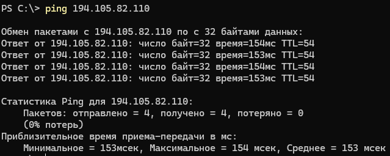
2. Проверим наличие IP-адреса в чёрных списках Роскомнадзора ([тут](https://blocklist.rkn.gov.ru/) или [тут](https://2ip.ru/rkn-blacklist/)).
3. Теперь проверим наличие IP-адреса в спам-базах ([тут](https://2ip.ru/spam/)). Одна-две записи - это относительно нормально, а вот большее кол-во вызывает вопросы
4. Проверим местоположение сервера по его IP-адресу. Это бывает достаточно сложной задачей, т.к. далеко не на всех сайтах базы IP-адресов часто обновляются, да и определение местоположения зависит от многих вещей. Тем не менее, относительно достоверно проверить страну своего IP-адреса можно по следующим ссылкам (только замените в них IP-адрес на адрес вашего сервера, для примера указан IP Арабских Эмиратов):
	- https://ipgeolocation.io/what-is-my-ip/194.105.82.110
	- http://www.geoplugin.net/json.gp?ip=194.105.82.110
	- https://ipinfo.io/194.105.82.110
	- Еще один сайт, где можно посмотреть местоположения серверов разных хостеров и получить информацию об ip: https://looking.house/
	- А на [этом сайте](https://bgp.he.net/) можно узнать официальную информацию об IP
5. В качестве точного способа можно воспользоваться командой `tracert server_ip` - это команда последовательно выполняет запросы на всё большее расстояния от вас до указанного ip-адреса. По местоположению последних выведенных доменов и скорости доступа к ним можно определить где и как далеко от вас находится выданный вам ip-асдрес.

Теперь можно подключаться. Открываем консоль (например, сочетанием клавиш Win + R и вбить "cmd" или "powershell". К слову, у Microsoft есть очень удобное приложение для работы с разными терминалами, называется [Windows Terminal](https://apps.microsoft.com/detail/9n0dx20hk701?hl=ru-ru&gl=RU)) и вводим команду подключения к серверу по SSH, нажимаем Enter. При первом подключении вас спросят, доверяете ли вы серверу. Говорим да и вводим пароль от root, который вы сохраняли ранее (не пугаемся, для безопасности отображаться он не будет).
```bash
# Где root - имя суперпользователя, xxx.xxx.xxx.xxx - ip-адрес вашего VPS-сервера
ssh root@xxx.xxx.xxx.xxx

# Например:
ssh root@194.105.82.110
```

---

## Шаг 3. Базовая настройка и обеспечение безопасности сервера
Ваш сервер вряд ли представляет "лакомый кусочек" для злоумышленников, однако необходимо закрыть самые базовые уязвимости, чтобы "залётный" хакер не смог вам навредить. 
- [Здесь](https://habr.com/ru/articles/756804/) можно посмотреть базовую настройку сервера + почитать комментарии (если хотите больше инфы).

> [!todo]+ Смена пароля суперпользователя (пользователя root):
> Вводим в консоль команду (подразумевается, что вы уже root):
> ```shell
> passwd
> ```
> Введите новый пароль для root-пользователя (для безопасности, при вводе он не отображается).
> Затем введите его повторно.
> - Вводите сложный пароль длинной 15-20 символов. Он должен состоять из заглавных и строчных букв, цифр и спец символов. А чтобы его легко было запомнить составляйте его из парольных фраз не относящихся к вашей жизни. 
>- Например, если вы никогда не играли в Minecraft, то подойдёт пароль: Minecraft_eto_moja_jizn’2024!!!2402. Такое легко запомнить и сложно подобрать.

> [!todo]+ Обновление пакетов
> Наличие последней версии системы по умолчанию увеличивает её безопасность (в новых версиях  частенько устраняют известные уязвимости). Следующие три команды обновят информацию об актуальных версиях пакетов, обновят их (это займёт некоторое время), а затем перезагрузят сервер (придётся подключиться повторно):
> ```bash
> apt update && apt upgrade -y && reboot
> ```

> [!todo]+ Защищаем SSH соединение
> Залётные хакеры первым делом пытаются подключаться к ssh (по стандартному порту 22, от имени root). Также Роскомнадзор может догадаться смотреть наличие открытого стандартного 22-го ssh порта у вашего сервера. Поэтому сделаем следующее:
> - Запретим подключение по ssh пользователю root (подключаться будем через вновь созданного пользователя);
> - Изменим стандартный порт подключения ssh (с 22-го на какой-нибудь другой);
> - Добавим подключение к ssh по ключам и запретим подключение по паролю.
> 
> 1. Т.к. доступ у root по ssh к серверу мы закроем, то надо создать нового пользователя, через которого и будем дальше подключаться. Создаём пользователя следующей командой (вместо "user_name" впишите любое имя пользователя, которое хотите и не забудете):
>    ```bash
>    adduser user_name
>    ```
>    Далее следуем инструкциям на экране, обязательно указывая пароль пользователя (как обычно, при вводе он не отображается). Прочие поля можно оставлять пустыми.
>    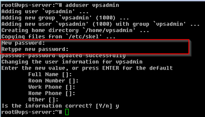
> - [I] Перейти от обычного пользователя к root можно командой:```su -```.
> - [I] От суперпользователя к обычному:```su user_name```
> 2. Заходим в настройки ssh-соединения с помощью редактора nano (всё делаем от суперпользователя):
>    ```bash
>    nano /etc/ssh/sshd_config
>    ```
>    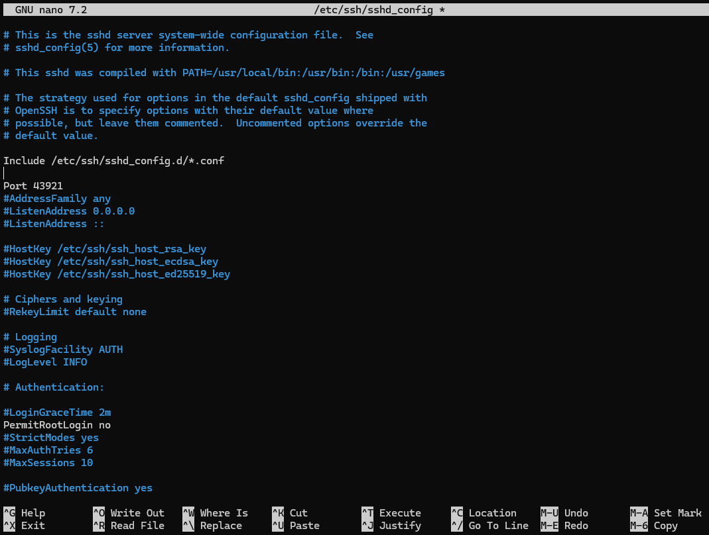
>    Ищем там строчку "# Port 22" и раскомментируем её  (убираем символ "#"), а также меняем порт на любой не занятый из диапазона 10001-65535 (посмотреть занятые порты можно командой "ss -lntup").
>    Также ищем строчку "PermitRootLogin yes" и меняем "yes" на "no", отключив тем самым возможность  подключения по ssh через root.
>    Сохраняем файл, нажав Ctrl + O, затем Enter, закрываем файл, нажав Ctrl + X.
>    <br>
> 3. Выполняем перезагрузку ssh командой:
>    ```bash
>    systemctl restart sshd
>    ```
>    <br>
> 4. Теперь подключение к вашему серверу будет выглядеть, например, так (имя пользователя, ip-адрес и порт указываете ваш):
>    ```bash
>    ssh user_name@194.105.82.110 -p 43921
>    ```
>    Примечания: если подключиться не удалось, проверьте правильность введённой информации. Если вы всё вводите верно, а подключиться не удаётся, значит либо сервер лёг (так совпало, что у вашего хостера какие-то проблемы), либо вы его некорректно настроили. Сбросьте систему до исходного состояния через сайт хостера и повторите попытку, уже внимательнее.
>    <br>
> 5. И напоследок крайне желательно использовать подключение по ssh не по паролю, а с помощью ключей, ведь подобрать ваш 20-значный пароль проще, чем очень длинный и сложный закрытый-ключ. Также настройка ssh-ключей позволит вам проще подключаться к серверу.
>    Если для вас этот пункт окажется слишком сложным, то его можно пропустить. 
>    Другой пример генерации ключей можно посмотреть [тут](https://selectel.ru/blog/ssh-authentication/). 
>    
>    Чтобы всё заработало, надо сделать две вещи: сгенерировать пару ключей (приватный, публичный) и скопировать публичный ключ на сервер. Публичный ключ используется на сервере для расшифрования информации и аутентификации пользователя, а приватный используется на клиенте (вашем ПК) для зашифрования информации.
>    Для генерации пары ключей в консоли windows выполняем команду, генерирующую ключи по более безопасному алгоритму на эллиптических кривых (вас спросят в какую директорию сохранить ключи и нужно ли использовать для них пароль. С одной стороны запаролить их будет безопаснее, с другой, пароль придётся вводить при каждом подключении, так что решайте для себя сами):
>    ```bash
>    ssh-keygen -t ed25519
>    ```
>    
>    Далее скопируем их на свой сервер (имя пользователя "user_name", ip-адрес сервера "server-ip" и номер порта "port_number" указываете свои). Команда для консоли Windows (берёт содержимое ключа, по ssh создаёт новую директорию и копирует ключ на ваш сервер):
>    ```bash
>    cat ~/.ssh/id_ed25519.pub | ssh user_name@server_ip  -p port_number "mkdir -p ~/.ssh && cat >> ~/.ssh/authorized_keys"
>    ```
>    Команда для Linux (если вы вдруг работаете на Linux или в WSL):
>    ```bash
>    ssh-copy-id user_name@server_ip -p port_number
>    ```
>    Затем проверьте подключение к серверу (все параметры вводите свои):
>    ```bash
>    ssh user_name@server_ip -p port_number
>    ```
>    Если всё успешно, то теперь в Windows настроим файл конфигурации SSH, чтобы подключаться просто по имени сервера. Для этого создадим файл ".ssh\\config"в директории пользователя (команда для powershell, можете создать этот файл и в ручную в папке вашего пользователя: "C:\\Users\\user"):
>    ```shell
>    New-Item -Path $HOME\.ssh\config -ItemType File
>    ```
>    Откроем его с помощью блокнота:
>    ```shell
>    Notepad $HOME\.ssh\config
>    ```
>    И заполним следующим содержимым (имя vps сервера может быть любым, указываете свой ip-адресс, имя пользователя и порт):
>    ```
>    Host vps_server
> 	   HostName 194.105.82.110
> 	   StrictHostKeyChecking no
> 	   User user_name
> 	   ForwardAgent yes
> 	   IdentityFile ~/.ssh/id_ed25519
> 	   IdentitiesOnly yes
> 	   AddKeysToAgent yes
> 	   ServerAliveInterval 60
> 	   ServerAliveCountMax 1200
> 	   PORT 43921
>    ```
>    Теперь подключиться можно простой командой:
>    ```shell
>    ssh vps_server
>    ```
>    Наконец, отключим на сервере возможность подключения по паролю. На сервере от имени суперпользователя вбиваем:
>    ```shell
>    nano /etc/ssh/sshd_config
>    ```
>    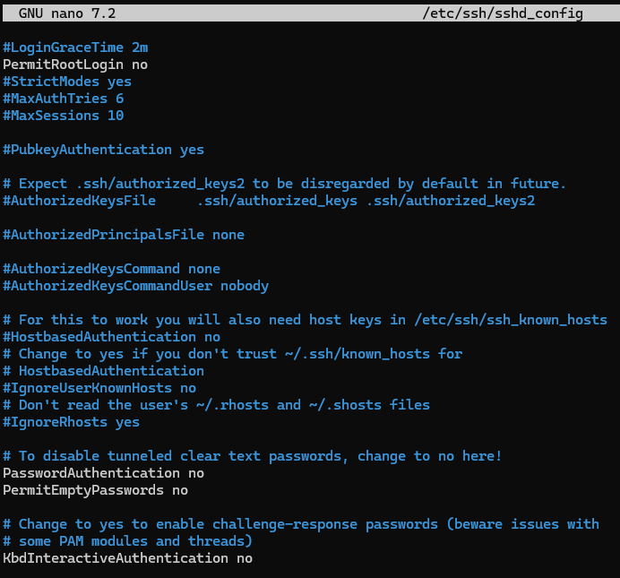
>    Находим строку с фразой "PasswordAuthentication yes", раскоментируем её и заменяем на "PasswordAuthentication no", а также следующую за ней строку "PermitEmptyPasswords no". И перезапускаем ssh:
>    ```shell
>    systemctl restart sshd
>    ```
>    Всё, наш SSH в безопасности!!!

> [!note]+ Защита от подбора пароля: установка Fail2ban
> Если вы настроили подключение к SSH по ключам, то этот пункт выполнять не обязательно. Если же вы всё ещё подключаетесь к серверу по паролю, то лучше настройте Fail2ban.
> 
> Fail2ban - программа для защиты серверов от атак методом грубой силы (Dos/DDos, простой подбор пароля). Учитывая, что большинство серверов и так имеют бесплатную защиту от DDos атак, а fail2ban потребляет лишние ресурсы, то его установка не обязательна, но желательна. Пример настройки [тут](https://linuxize.com/post/install-configure-fail2ban-on-ubuntu-20-04/).
> Устанавливается следующей командой:
> ```bash
> apt install fail2ban
> ```
> Просмотр статуса:
> ```bash
> systemctl status fail2ban
> ```
> По умолчанию он будет банить на 10 минут после 5 подряд неверных попыток ввода пароля. Изменить это можно в файле конфига (не забудьте изменить порт ssh, если меняли его):
> ```bash
> nano /etc/fail2ban/jail.conf
> ```
> После чего перезапустить программу:
> ```bash
> sudo systemctl restart fail2ban
> ```

> [!todo]+ Установка необходимых пакетов
> Теперь установим все пакеты, которые могут понадобиться:
> ```bash
> apt install git nmap net-tools curl docker.io docker-compose openssl -y
> ```
> - git - система контроля версий, часто нужна, чтобы скачать какое-нибудь ПО.
> - nmap - для 'простукивания' портов, помогает проверить что на сервере лишние порты не открыты.
> - net-tools - сюда входит популярный `ifconfig` и `netstat`, часто облегчает работу с сетью.
> - curl - для выполнения http запросов прямо из консоли.
> - docker.io и docker-compose - для запуска контейнеров с настроенным ПО (например, графической панели 3X-UI для настройки vless).
> - openssl - для SSL сертификатов

---

## Шаг 4. Выбор сайта для маскирования
Для корректной работы Vless-Reality нужно очень ответственно подойти к выбору сайта, под который мы будем маскироваться. От используемого домена маскировки зависит скорость установления подключений клиентов к вашему серверу (а их будет устанавливаться много) и устойчивость вашей маскировки. Если после настройки все работает, но сильно тормозит при серфинге, попробуйте использовать другой маскировочный домен (в идеале это должен быть какой-то сервер в той же стране, где и ваш VPS).

> [!warning]+ Примечания
> Важно отметить тот факт, что XTLS‑Reality имеет недостаток — если сайт, под который вы маскируетесь, испытывает технические проблемы (например, временно отключил TLSv1.3), или огородился от вашего сервера (устав от проксируемых запросов на установление соединений), или попал под блокировку, то точно так же перестанет работать и ваш прокси. В этом случае совершенно нормально будет поменять используемый маскировочный домен на какой‑то другой.

> [!NOTE]+ Требования к маскировочному сайту
> В общем, к такому сайту предъявляются следующие минимальные требования:
> 1. Сайт должен располагаться на иностранном сервере (вне РФ).
> 2. Это должен быть относительно популярный сайт не связанный с политикой или СМИ, не относящийся к "нежелательным организациям" и к которому вряд ли возникнут вопросы  у Роскомнадзора (очевидно, какой-нибудь youtube или google тут не подойдут).
>    Но не не используйте слишком крупные сайты в качестве маскировки. Множество крупных сайтов имеют CDN в стране, поэтому их использование не рекомендуется (это например касается Google и других крупных игроков, хотя Microsoft в 22 году отключила CDN в РФ). Ведь если у сайта есть сервера в стране, то с точки зрения наблюдателя (цензора) в нормальных условиях, вы должны обращаться к локальным адресам внутри страны, а не выходить за ее пределы.
> 3. Поддерживает подключения по TLSv1.3 и HTTP/2 (проверить поддержку TLS можно [так ](https://serverfault.com/questions/1015188/how-to-check-whether-remoter-server-support-tls-1-3), а HTTP/2 [так](https://stackoverflow.com/questions/54091567/how-to-check-if-a-website-has-http-2-protocol-support)).
> 4. Имеет заглавную страницу, которая _не_ переадресовывает на какой-нибудь другой домен (то есть, перейдя по ней в браузере, её адрес не заменится на другой и не добавится поддоменов + она отобразится без каких-либо ошибок).<br>
> Дополнительные требования:
> 5. **IP-адрес камуфляжного веб-сайта близок к IP-адресу вашего сервера**
>    Наличие IP-адреса, близкого к вашему серверу, означает, что камуфляжный веб-сайт имеет IP-адрес, который близок к IP-адресу вашего сервера с точки зрения сетевого расстояния или географического местоположения. 
>    Это может сделать соединение более эффективным и менее подозрительным.
> 6. **Сообщения о рукопожатии после «Server Hello» шифруются вместе**
>    Некоторые веб-сайты могут не шифровать сообщения рукопожатия после «Server Hello» вместе, а вместо этого отправлять их отдельно в виде открытого текста. Это может предоставить информацию о сервере и клиенте, например, поддерживаемые ими наборы шифров, расширения и сертификаты. Злоумышленники могут использовать это для идентификации сервера и клиента. 
>    Поэтому сервер и клиент должны обменяться зашифрованными данными после первоначального подтверждения TLS, предотвращая подслушивание или вмешательство третьих лиц.
> 7. **Сервер поддерживает Online Certificate Status Protocol (OCSP)**
>    Сервер поддерживает сшивание OCSP, что означает, что сервер может предоставить подтверждение действительности своего сертификата, не требуя от клиента обращения в центр сертификации. Это может улучшить производительность и конфиденциальность соединения. Посмотреть это можно, нажав на "замок" слева от сайта и перейдя к просмотру информации о сертификате.

> [!question]+ Как найти подходящий сайт?
> Это может занять некоторое время, но вариантов несколько:
> - Первый простой - воспользоваться [специальной утилитой](https://github.com/XTLS/RealiTLScanner), которая ищет сайты в той же подсети, что и ваш сервер и проверяет поддержку ими TLSv1.3 и HTTP/2. Алгоритм её использования следующий:
> 	1. Заходите на сайт и справа в разделе "[Releases](https://github.com/XTLS/RealiTLScanner/releases/)" скачиваете исполняемый файл (*.exe) для Windows.
> 	2. Открываем консоль в папке с этим файлом (в проводнике "Файл"->"Запустить Windows Power Shell от имени администратора") и запускаем её, указав ip-адрес вашего сервера:
> 	   `.\RealiTLScanner-windows-64.exe -addr server_ip`
> 	3. Запустится процесс сканирования ip-адресов в бесконечном режиме. Обычно она находит большинство сайтов за первые минут 10-30. Если будут найдены какие-либо домены сайтов (поле "cert-domain"), то они отобразятся. Попробуйте сходить по ним в браузере. Если не открывается, или лезут ошибки - такой домен нам не подходит, а если открывается и ошибок нет - можно попробовать маскироваться под него. Пример сканирования случайного адреса:
> 	   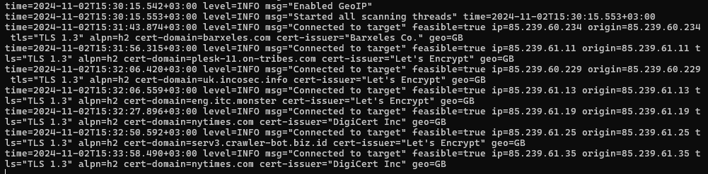
> 	   В данном случае были найдены нормальные домены "barxeles.com" и "nytimes.com".
> 	4. Помимо этого не будет лишним зайти на ваш сервер и с него выполнить команду ping до указанного сайта, чтобы из нескольких подходящих сайтов выбрать тот, который ближе всего к вашему VPS-серверу.
> - Вариант второй - поиск сайта самостоятельно и его проверка на соответствие требованиям. Например, ваш сервер находится в Нидерландах, находим [список нидерландских сайтов](https://polpred.com/?cat=5&cnt=114) и выбираем понравившийся. Пробуем по нему перейти. Если всё ок, то проверяем его на соответствие требованиям, проверяем ping от вашего сервера до него и пытаемся маскироваться под него. 
> - Вариант третий (если предыдущие варианты не прокатили) - маскироваться под сайт "по умолчанию" (yahoo.com) или какой-нибудь из следующих сайтов. Работать будет, но вот надёжность остаётся под вопросом:
> 	- www.samsung.com
> 	- www.asus.com
> 	- www.amd.com
> 	- www.cisco.com
> 	- www.microsoft.com
> 	- www.linksys.com
> 	- www.nvidia.com
> 	- и т.д.
> <br>
> Самое сложное позади. Дальше легче)

---

## Шаг 5. Установка панели 3-XU (X-UI)
Установим панель 3-XU на сервере.
1. Подключаемся к серверу по ssh:
```bash
# Если настроили подключение через SSH-ключи
ssh vps_server

# Если подключаетесь по паролю (имя, ip и порт свои)
ssh user_name@ip_address -p port_number
```
2. Переключаемся на root и вводим от него пароль:
```bash
su -
```
3. Клонируем (копируем) исходники панели с Github:
```bash
git clone https://github.com/MHSanaei/3x-ui.git
```
4. Этот и следующий пункты нужны только, если вы хотите выбрать конкретную версию панели, т.к. у самой последней могут быть проблемы.
   Переходим в клонированную папку и переключаемся на последнюю стабильную версию (последний стабильной номер смотри на странице github в разделе [Releases](https://github.com/MHSanaei/3x-ui/releases), на 19.10.2024 это 2.4.5):
```bash
cd 3x-ui && git checkout v2.4.5
```
5. В файле конфигурации Docker-Compose ("docker-compose.yml") в поле image заменяем фразу "latest" на номер выбранной версии (например, "v2.4.5"), затем Ctrl + O и Ctrl + X:
```bash
nano docker-compose.yml
```
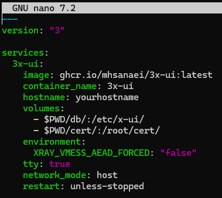
-
6. Запускаем панель:
```
docker-compose up -d
```
Теперь панель запущена и готова к работе. На сервере - это всё, вы восхитительны!
Остальное будем настраивать через браузер.

---

## Шаг 6. Настройка VLESS-Reality через панель 3X-UI
> [!todo]+ Подключение к панели
> По умолчанию панель доступна на порту 2053 вашего сервера (правда, чуть позже мы его изменим) и к ней можно подключиться из браузера, перейдя по ссылке (только указывайте ip-адрес своего сервера):
> ```http
>    http://194.105.82.110:2053/
> ```
> Имя пользователя и пароль по умолчанию одинаковые - ==admin==.
> ***Если вдруг у вас установлен файерволл (т.е., команда `ufw --version` выводит версию вместо ошибки), то тогда надо разрешить подключение по порту 2053 командой `ufw allow 2053`.***
> 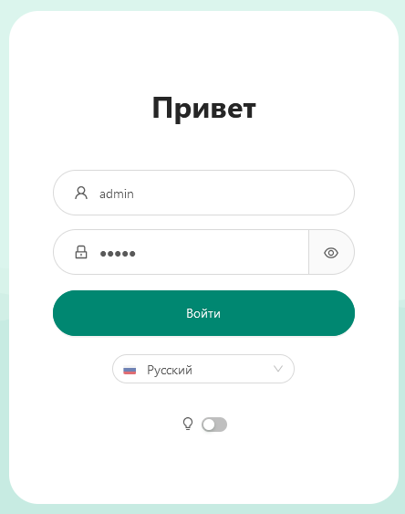
> Однако, подключение осуществляется по незащищённому http протоколу, что не очень хорошо. Поэтому я рекомендую подключаться через проброс портов по SSH. Вот как это сделать:
> 
> 1. Если вы настраивали подключение по SSH с помощью ключей, то в файле конфигурации (C:\Users\your_user\\.ssh\config) добавляем следующую строку:
>    ```
>    LocalForward 22222 127.0.0.1:2053
>    ```
>    Вместо "22222" пишите любой не занятый порт вашего ПК больше 1024. Данная строчка говорит SSH сделать следующее: все обращения по локальному порту "22222" вашего ПК пересылай на порт 2053 сервера по SSH. Таким образом, пока открыт SSH соединение с вашим севером, панель 3X-UI будет доступна у вас в браузере по адресу:
>    ```http
>    http://127.0.0.1:22222/
>    ```
>    Порт "22222" замените на свой, а вот ip-адрес "127.0.0.1" менять не надо. Он особенный и указывает на ваш компьютер.<br><br>
> 
> 2. Альтернативным способом является указание проброса портов сразу в команде ssh, но делать это придётся каждый раз:
>    ```bash
>    # Первый порт (22222) - локальный порт вашего ПК, 
>    # второй (2053) - порт панели
>    ssh -L 23456:127.0.0.1:2053 vps_server
>    ```

> [!todo]+ Улучшение безопасности панели
> Как и в случае с сервером надо проделать базовые настройки по улучшению безопасности панели.
> 1. Заходим в раздел "Настройки панели"-> "Настройки панели" и меняем следующие параметры:
> 	- По умолчанию, к панели можно подключиться напрямую по ip-адресу вашего сервера, указав соответствующую ссылку в браузере. Закрываем доступ к панели из вне, указав в полях "IP-адрес панели" и "Домен прослушивания панели" значение "127.0.0.1". ***Таким образом, к панели можно будет получить доступ только после того, как мы подключились к серверу по SSH***.
> 	- Изменяем стандартный порт панели с 2053 на какой-нибудь свой от 10001 до 65535 (его придётся изменить и в конфигурационном файле SSH на вашем ПК чуть позже).
> 	- Изменяем поле "Корневой путь URL адреса панели" (по умолчанию это "/") на что-нибудь своё вроде "/mysecretpanel/".
>    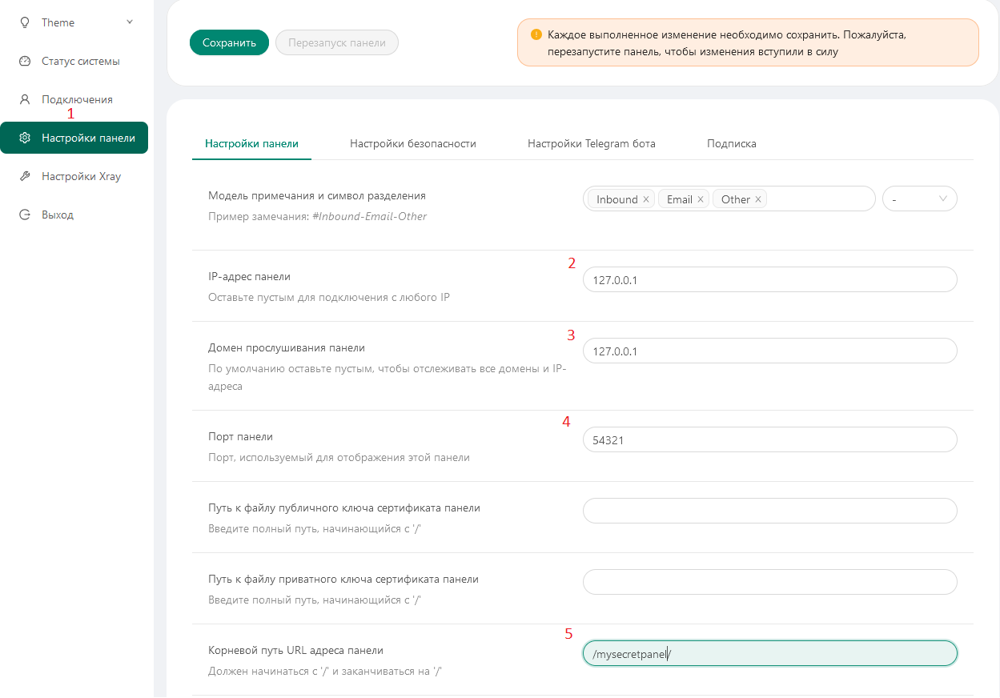
> 2. Переходим во вкладку "Настройки безопасности" и меняем стандартное имя пользователя и пароль на свои.
>    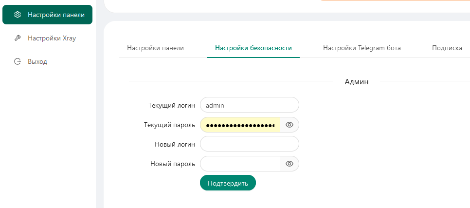
> 3. Нажимаем "Сохранить" и "Перезапуск панели". Панель перезапустится и доступ к ней закроется.
> 4. Если настраивали подключение по ключам, то на вашем компьютере в файле (C:\Users\your_user\\.ssh\config) в строке:
>    `LocalForward 22222 127.0.0.1:2053`
>    заменяем "2053" на новый порт, который вы указали в настройках панели.
> 5. Теперь проверим правильность наших настроек. Закрываем панель и отключаем SSH-соединение, вбив в консоль команду `exit`. Вход в панель будет осуществляться следующим образом:
>    - Подключаемся по SSH к вашему серверу снова так: `ssh vps_server` 
>      или так (если не настраивали файл конфигурации): 
>      ```bash
>      # Замените "22222" - на локальный порт вашего ПК, а
>      # "54321" на порт панели, который указали в первом пункте.
>      ssh -L 22222:127.0.0.1:54321 user_name@server_ip -p port_nunmber
>      ```
>      Теперь в браузере вбиваем: 
>      ```http
>      # Замените "22222" - на локальный порт вашего ПК, а
>      # "mysecretpanel" на корневой путь к вашей панели, который вы указали ранее.
>      http://127.0.0.1:22222/mysecretpanel/
>      ```
>      Вы должны увидеть всё то же окно приветствия.
>    - Или напрямую через браузер, если по SSH к панели подключаться не хотите (если вы заменили IP-адрес панели на 127.0.0.1, то теперь такое подключение должно стать не возможным):
>      ```bash
>      # "server_ip" заменяете на ip-адрес вашего сервера,
>      # "panel_port" на ваш порт панели,
>      # "mysecretpanel" на ваш корневой путь URL к панели.
>      http://server_ip:panel_port/mysecretpanel/
>      ```

> [!todo]+ Настройка маршрутизации трафика
> Теперь сделаем ещё несколько вещей: заблокируем возможность скачивать торренты через наш сервер (чтобы нам не прилетали жалобы от провайдера, если кто-то попытается качать торренты через наш VPS) и заблокируем доступ к сайтам РФ через наш VPS (чтобы в случае ошибочной настройки клиента, не спалить наш VPS-сервер).
> 1. Заходим в раздел "Настройки Xray"->"Базовые шаблоны"->"Блокировка конфигураций" и включаем "Запрет использования BitTorrent":
>    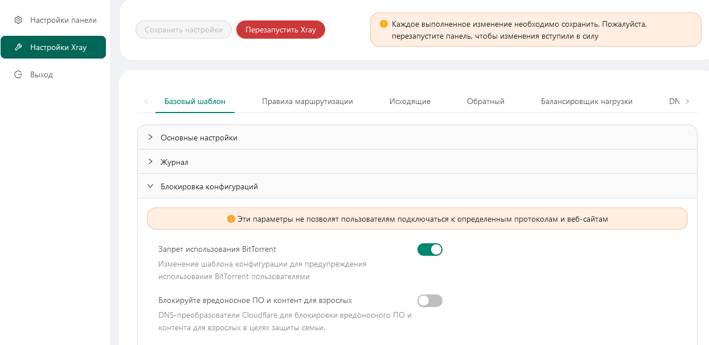
> 2. Запретим доступ через VPS к Российским сайтам. Заходим во вкладку "Правила маршрутизации" и нажимаем "Добавить правило":
>    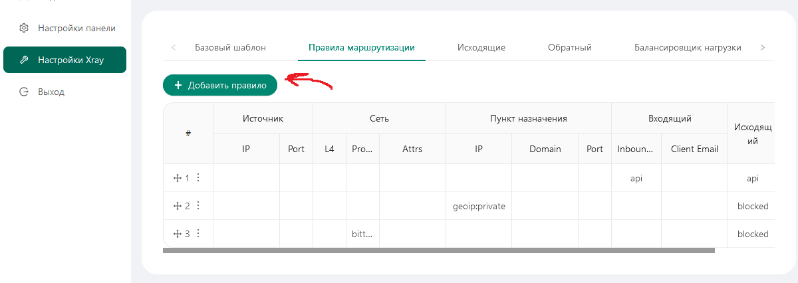
> 3. В поле "Domain" вписываем следующую строку: 
>    `geosite:category-ru,redexp:.*\.ru,regexp:.*\.su`
>    и выбираем тип выходного подключения (Outbound Tag) `blocked`:
>    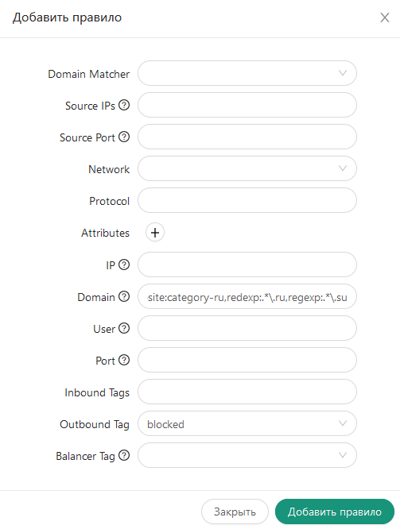
> 4. Нажимаем "Добавить правило", затем "Сохранить настройки" и "Перезапустить Xray".

> [!todo]+ Добавление подключения и первого клиента
> На завершительном этапе настройки сервера создадим подключение по протоколу VLESS XTLS-Reality и добавление настроек клиента. Одно подключение - это настройка одного протокола, по которому может подключаться множество клиентов. Каждый клиент - это отдельное устройство (ПК, телефон).
> 1. Заходим в раздел "Подключения" и нажимаем "Добавить подключение":
>    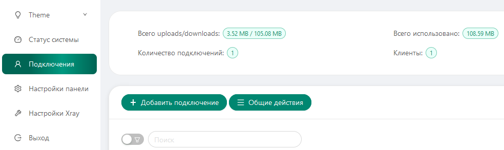
> 2. Откроется окно с кучей настроек. Не пугаемся и заполняем всё внимательно. При неправильной настройке ничего работать не будет.
>    - "Примечания": это название вашего подключения. Будет отображаться на клиентах. Пишем любое понравившееся название, например, "VLESS-Reality";
>    - "Протокол": тип используемого протокола, выбираем "vless";
>    - "Порт IP": на самом деле, это IP-адрес, по которому будет производиться подключение. *Если в настройках панели вы меняли стандартный IP адрес на "127.0.0.1", то вписываем адрес вашего сервера, в противном случае можно оставить пустым* (дело в том, что панель автоматически подставляет сюда тот IP-адрес, который указан в её настройках);
>    - "Порт": порт, по которому производится подключение. Для VLESS это всегда 443, ***поэтому меняем со случайного на 443***;
>    - При желании, можно задать ограничения на общий объём трафика для всего подключения;
>    - В нижней части окна в поле "Безопасность" выбираем "Reality". После этого часть полей изменится.
>      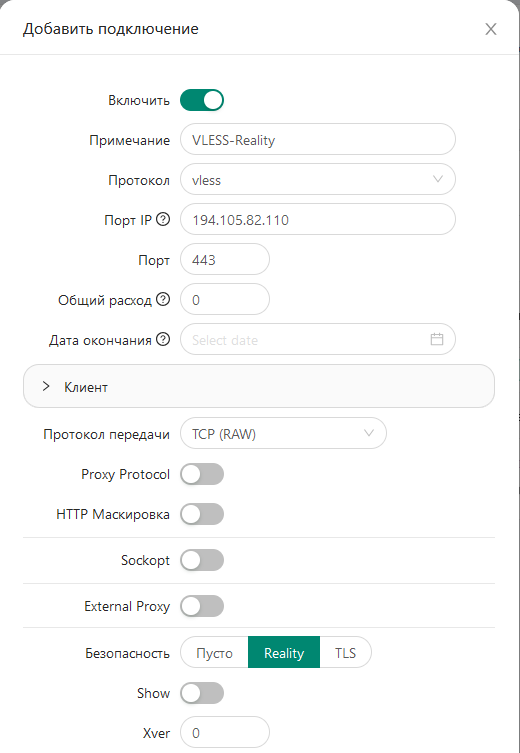
>  3. Теперь настроим первого клиента (раскрываем выпадающее окно с клиентом и заполняем):
>     - Переводим ползунок "Включить" в правое положение;
>     - "Email": имя пользователя (клиента), панель генерирует случайный набор символов, если вы хотите создавать несколько разных пользователей (например, раздать аккаунты друзьям, смотреть кто сколько накачал и при желании блокировать доступ), то лучше вбить сюда что-то человекочитаемое и понятное, например, "ClientMyPC_vl".
>       Важно: пользователи разных подключений/протоколов не могут иметь один и тот же email;
>     - "ID": случайный идентификатор пользователя. Можете сгенерировать его заново при желании;
>     - "Subscription" - поле, необходимое для механизма подписок и появляется, только, если он включён (пока игнорируйте). Значение лучше вписывать такое же, что и имя пользователя;
>     - "Flow": способ транспортировки трафика, выбираем "xtls-rprx-vision". Обратите внимание, поле Flow появится только после того, как чуть ниже вы выберите "Reality";
>     - При желании можно задать ограничения на объём трафика для пользователя.
>       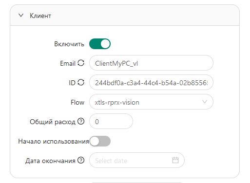
>   4. Заканчиваем настройку протокола, заполняя остальные поля:
>      - "Протокол передачи": выбираем "TCP (RAW)";
>      - "Xver": оставляем 0.
>      - "uTLS": выбираем чей цифровой отпечаток будем использовать. Я рекомендую использовать "firefox" или "chrome" (главное чтобы не "android", могут быть проблемы с клиентами);
>      - "Dest (Target)": самое интересное, это домен (сайт), под который вы будите маскироваться. По умолчанию панель предлагает маскировку под yahoo.com и www.yahoo.com с переадресацией на yahoo.com:443, но лучше выбрать какой-нибудь другой домен, как описано ранее;
>      - "Max Time Diff (ms)": оставляем 0;
>      - "Short ID": можно сгенерировать повторно;
>      - "Spider X": оставляем значение по умолчанию;
>      - Теперь нажимаем на кнопку "Get New Cert", чтобы сгенерировать новый приватный и публичный ключ (должны заполниться поля "Приватный ключ" и "Публичный ключ");
>      - В выпадающем меню "Sniffing" включаем его. Это функция прослушивания трафика. Нужна для его правильной маршрутизации;
>      - Всё, нажимаем "Создать".
>        

> [!todo]+ Получение клиентских настроек и добавление новых клиентов
> После всего этого на странице видим, примерно, вот это:
> 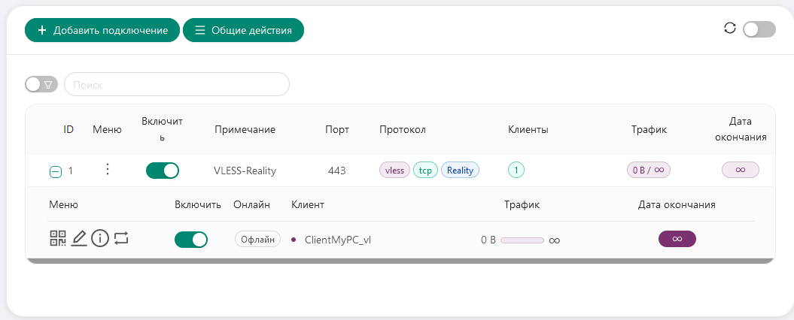
> При желании, данное подключение можно изменить, удалить или добавлять новых пользователей (нажав ЛКМ по трём точкам возле подключения). При добавлении новых пользователей теперь потребуется заполнить только поля "Email" и "Flow".
> Создайте себе столько клиентов, сколько устройств вы хотите подключить. ==***Каждого "Клиента" можно использовать для подключения только одного устройства!***==
> 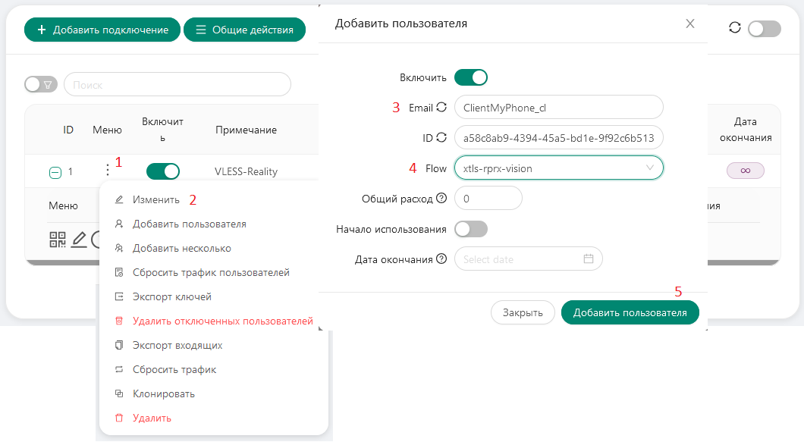
> Раскрыв на плюсик список пользователей, можно посмотреть настройки подключений пользователей для их вбивания в клиенте (убедитесь, что они верны, особенно ip-адрес сервера). Нажав на значок QR-кода, появится QR-код, который можно отсканировать камерой мобильного телефона в клиентских приложениях (об этом позже). Нажав на иконку информации (с буквой "i"), можно посмотреть настройки для вбивания в десктопные клиенты, в том числе и URL, который можно скопировать и вставить. Сохраните себе QR-code (для телефона) или URL (для ПК/телефона), они понадобятся далее при настройке клиента.
> 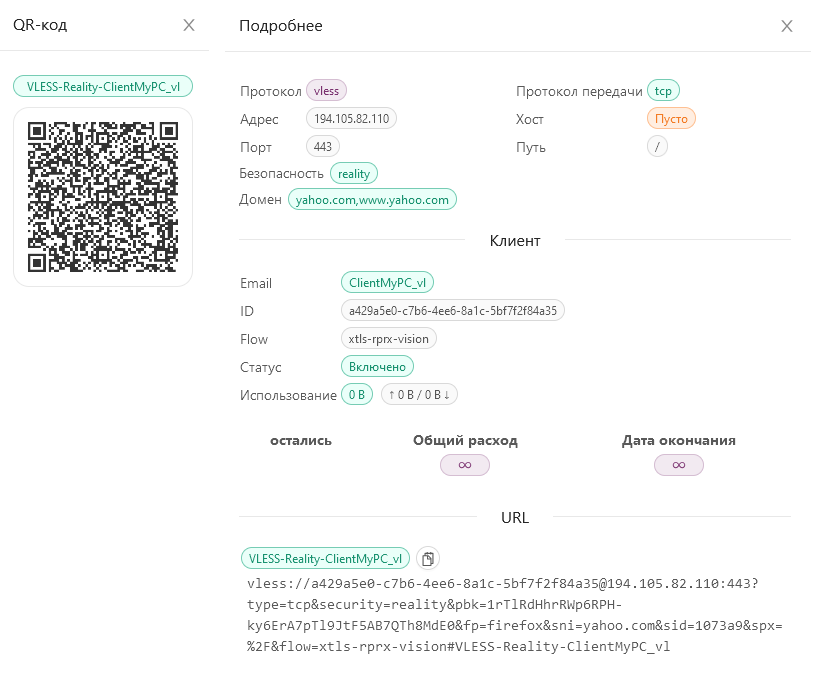

С настройкой серверной стороны мы закончили и теперь всё работает. Остаётся только подключиться к нему с клиента на ПК или телефоне!

---

## Шаг 7. Настройка клиентского приложения (на компьютере и телефоне)
Весьма важно настроить на клиентских устройствах правила, чтобы доступ к внутренним (российским, если вы в РФ) ресурсам не шел через прокси-сервер. Немного о правилах предосторожности (чего не стоит делать ни в коем случае):
1. **Не компрометировать VPS** протоколами, которые могут быть обнаружены (не ставить туда WireGuard, OpenVPN, Shadowsocks, ...). Некоторые провайдеры уже [блокируют](https://habr.com/ru/articles/770400/#comment_26117470) VPS, на которых в прошлом были замечены подобные протоколы.
2. **Не ходить в рунет через VPS**, вместо этого посещать рунет напрямую, мимо прокси (настроим правила маршрутизации на клиентах). В крайнем случае, пускать российский трафик по цепочке Я->VPS->Warp->Рунет (это тоже легко настроить). Дело в том, что если трафик пересекает границу РФ дважды в условную секунду (сначала туда, потом сразу обратно), то цензор может заподозрить прокси и заблокировать его. В Китае так делают, у нас - нет, но могут научиться в любой момент.
3. Обязательно используйте uTLS на клиентах, выставляя правильный TLS fingerprint (например, Chrome или Firefox).
4. **Не раздавать доступ к прокси** большому количеству людей. 5-10 близких максимум. В Китае уже вычисляют аномальный трафик к серверу от большого числа юзеров (и блокируют сервер), у нас - опять же - могут перенять их опыт в любой момент.

Клиентских приложений довольно много, я рекомендую использовать следующие, они стабильные и удобно настраиваются:
- Windows/Linux/MacOS: [Nekoray](https://github.com/MatsuriDayo/nekoray) / [Nekobox](https://github.com/MatsuriDayo/nekoray/releases) (с ядром sing-box);
- Android: [Nekobox Android](https://github.com/MatsuriDayo/NekoBoxForAndroid/releases) ;
- Для IOS **Wings X** / **[FoXray](https://apps.apple.com/us/app/foxray/id6448898396)** либо **[Shadowrocket](https://apps.apple.com/us/app/shadowrocket/id932747118)**;
- Или [Hiddify-Next](https://github.com/hiddify/hiddify-next) для всех платформ;

> [!todo]+ Настройка клиента на компьютере
> 1. Скачиваем приложение [Nekoray](https://github.com/MatsuriDayo/nekoray) из раздела "[Releases](https://github.com/MatsuriDayo/nekoray/releases)". На 19.10.2024 последняя стабильная версия 3.26 (похоже, перестал разрабатываться). Для Windows скачиваем архив "nekoray-3.26-2023-12-09-windows64.zip" и разархивируем его.
>    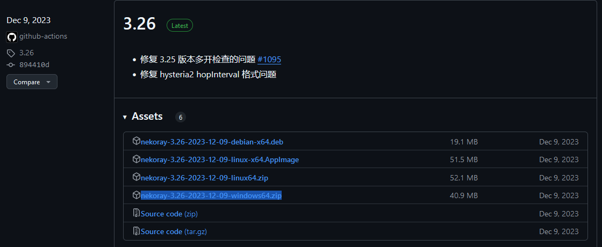
> 2. При первом запуске у вас спросят какое ядро вы хотите использовать. Выбираем `sing-box`.
>    
> 3. У нас откроется следующее графическое окно, в котором будут отображаться текущие подключения.
>    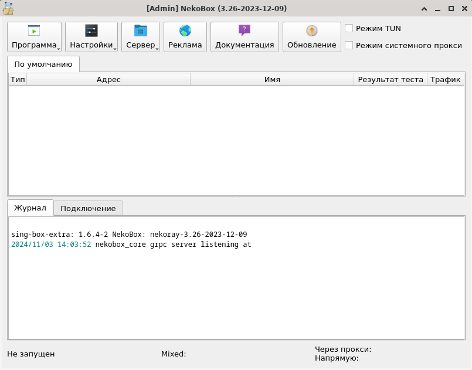
> 4. Копируем URL адрес клиентского профиля, который создавали ранее. В Nekoray выбираем вкладку "Сервер"->"Добавить профиль из буфера обмена". После чего у нас появится наш клиентский профиль со всеми настройками сервера.
>    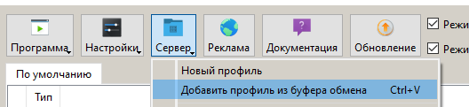
> 5. Прежде, чем запустить клиент, настроим маршрутизацию. Переходим в "Настройки"->"Настройки маршрутов"->"Общие" и убеждаемся, что в поле "Режим подслушивания" установлено "Подслушивать для маршрутизации".
>    Далее переходим в "Настройки"->"Настройки маршрутов"->"Базовые маршруты". 
>    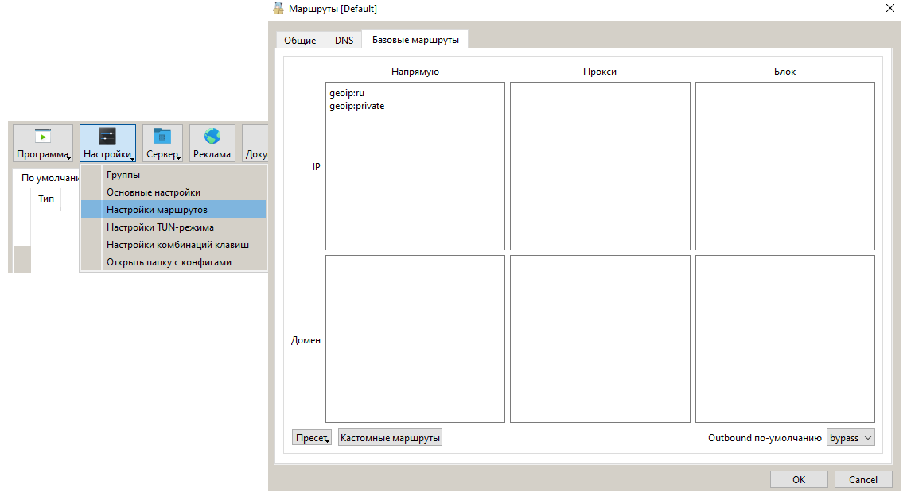
> 6. Можно настроить маршрутизацию по-разному:
>    - Маршрутизировать всё, кроме определённых приложений/сайтов/... .
>    - Или наоборот, маршрутизировать только определённые приложения и в них ещё дополнительно сделать исключения для некоторых сайтов.
>    Я рекомендую пойти по второму пути: маршрутизировать трафик только от нужных вам приложений, по типу Dicord и браузера. Поэтому справа снизу в разделе "Outbound по-умолчанию" (т.е. исходящие подключения) выбираем `bypass` (т.е. напрямую, без маршрутизации).<br><br>
> 7. Теперь настроим приложения, для которых нужна маршрутизация и добавим исключения для Российских сайтов. В левом нижнем углу выбираем: "Кастомные маршруты".
>    В окошке слева в формате JSON будем прописывать маршруты. Все правила в этом файле строятся достаточно просто: указывается ключевое слово для правила, а также тип подключения (прямое - `direct` или через прокси-сервер - `proxy`). Таким образом, можно управлять подключениями не только целых приложений, но и подключением к определённым сайтам внутри самих приложений (например, не проксировать Steam, но проксировать доступ к youtube внутри него).
>    - Подробное описание полей и правил маршрутизации смотри в приложении 1.
>    - Подробно все правила маршрутизации описаны [здесь](https://sing-box.sagernet.org/configuration/route/rule/) в официальной документации разработчиков sing-box.
>    - Также очень много описано в [этой статье](https://habr.com/ru/articles/770400/) на Хабре (в РФ заблокирована).<br><br>
>    
> 8. Правила маршрутизации нашего трафика будут следующие:
>    - По умолчанию весь трафик не маршрутизируется (это мы указали ранее).
>    - Будем маршрутизировать трафик только от двух процессов (Discord и браузер, в моём случае это процесс firefox.exe). Чтобы точно узнать название процесса, который хотите маршрутизировать, зайдите в диспетчер задач -> Процессы, отсортируйте все процессы по имени, найдите ваш браузер, раскройте его процессы и посмотрите его название (если у вас нет колонки "Имя процесса", то нажмите по строке с колонкам ПКМ и добавьте её). В моём случае это процесс "firefox.exe".
> 	   - Т.к. по умолчанию от браузера мы будем маршрутизировать весь трафик, то надо добавить исключения для Российских сайтов. Поэтому будем отправлять напрямую трафик от РФ сайтов (.ru/.su и т.д.) и IP-адресов, зарегистрированных в РФ (правило "geoip").
> 	   - И ещё одно: дело в том, что есть ещё ряд сайтов, сотрудничающих с РФ (Yandex, VK, и прочее). Поэтому трафик к ним тоже надо настроить напрямую, а не через прокси (за это отвечает правило "domain_keyword" (тип трафика: "outbound": "direct")).
>    Базовый вариант таких настроек я привожу ниже. Скопируйте его и вставьте в окошко nekoray, при необходимости измените имя процесса для вашего браузера (в правиле "process_name") и список Российских сайтов, если считаете, что он не полный:
> ```JSON
> {
>     "rules": [
>         {
>             "domain": [
>             ],
>             "domain_keyword": [
>                 "yandex",
>                 "yastatic",
>                 "yadi.sk",
>                 "xn--80aswg",
>                 "xn--d1acpjx3f.xn--p1ai",
>                 "xn--c1avg",
>                 "xn--80asehdb",
>                 "xn--p1acf",
>                 "xn--p1ai",
>                 "google.com",
>                 "gstatic.com",
>                 "yahoo",
>                 "bing",
>                 "tineye",
>                 "duckduckgo",
>                 "apple",
>                 "vk.com",
>                 "userapi.com",
>                 "vk-cdn.me",
>                 "mvk.com",
>                 "vk-cdn.net",
>                 "vk-portal.net",
>                 "vk.cc",
>                 "icq",
>                 "livejournal",
>                 "microsoft",
>                 "live.com",
>                 "login.live",
>                 "tradingview"
>             ],
>             "domain_regex": [
>             ],
>             "domain_suffix": [
>                 ".ru",
>                 ".su",
>                 ".by"
>             ],
>             "geoip": [
>                 "private",
>                 "ru",
>                 "by"
>             ],
>             "geosite": [
>             ],
>             "outbound": "direct"
>         },
>         {
>             "outbound": "proxy",
>             "process_name": [
>                 "Discord.exe",
>                 "firefox.exe"
>             ]
>         }
>     ]
> }
> ```
>    В итоге получится примерно следующее. Нажимаем ОК и закрываем.
>    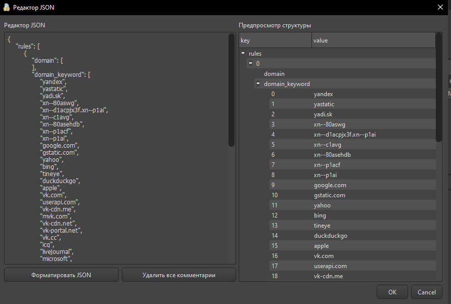
> 9. Дополнительно настроим режим TUN/VPN. Без него некоторые из приложений не смогут работать через прокси (например, голосовые чаты в Discord). Нажимаем "Настройки"->"Настройка Tun режима". В открывшемся окне в левом нижнем углу включаем "режим белого списка", установив галочку (это позволит проксировать только определённые приложения). В столбце слева указываем процессы тех приложений, которые хотим проксировать (для меня это всё тот же браузер и Discord). Нажимаем ОК.
>    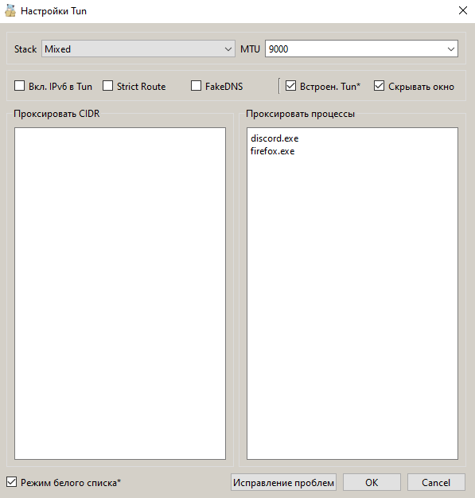
>10. Теперь наконец можно запустить клиент и проверять как всё работает. Выходим из настроек маршрутов, нажимаем по нашему подключению ПКМ и жмём "Запустить", затем справа сверху ставим галочки на "Режим TUN" и "Режим системного прокси". Если всё было настроено верно, то не должно возникать ошибок, а если запустить браузер, то в логах (журнале) начнут отображаться подключения. Переходите к проверке работоспособности подключения.
>    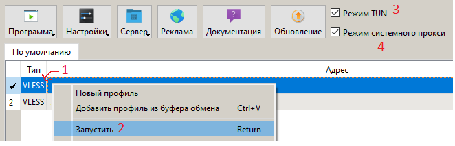
>    Одну проверку можно выполнить сразу: жмём ПКМ по подключению-> "Текущий Выбор"->"TCP Ping" или "URL Test". Если в поле "Результат теста" появились цифры, то, как минимум, связь с сервером настроена верно.
>    Теперь нужно проверить правильность настройки маршрутов (смотрите ниже).

> [!todo]+ Настройка клиента на мобильном телефоне
> 1. Для телефона скачиваем мобильный клиент из раздела [Releases](https://github.com/MatsuriDayo/NekoBoxForAndroid/releases) уже другого [Github](https://github.com/MatsuriDayo/NekoBoxForAndroid) репозитория. Последняя стабильная версия на 04.11.2024 - 1.3.2.
>    Там будет доступно несколько "*.apk" файлов для разных архитектур процессора. Как узнать какая у вас? Самый простой способ - это зайти в Telegram->Настройки, пролистать в самый низ, где будет указана ваша архитектура ядра (чаще всего это arm64-v8a). Ещё можно скачать приложение **Droid Hardware Info** и посмотреть там.
>    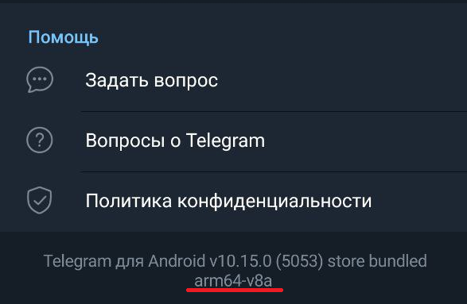
> 2. Теперь добавим настройки подключения (заранее создайте нового клиента в 3X-UI консоли, настройки одного клиента можно использовать только для одного устройства, откройте QR-код или скопируйте в телефоне URL ссылку). Заходим в приложение (выбираем ядро sing-box, если при первом запуске у вас спросят). В правом верхнем углу нажимаем на значок файла с плюсиком, выбираем сканировать QR-код или импортировать из буфера обмена и, соответственно, либо сканируем QR-код либо сразу вставятся данные из ссылки.
>    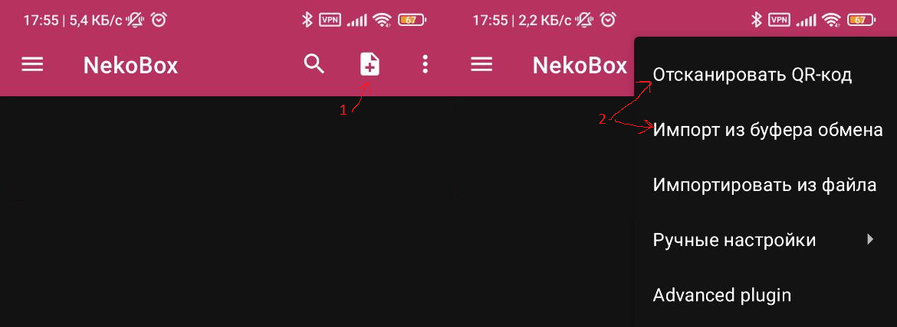
> 3. Появится подключение, но прежде, чем его включать, добавим правила маршрутизации для сайтов браузера (пропустите, если вас не интересует браузер), также, как и для ПК. Жмём на значок меню в левом верхнем углу и переходим в "Маршруты". Включаем пункты: "Блокировать рекламу", "Блокировать аналитику", "Правило домена для Russia" и "Правило IP для Russia":
>    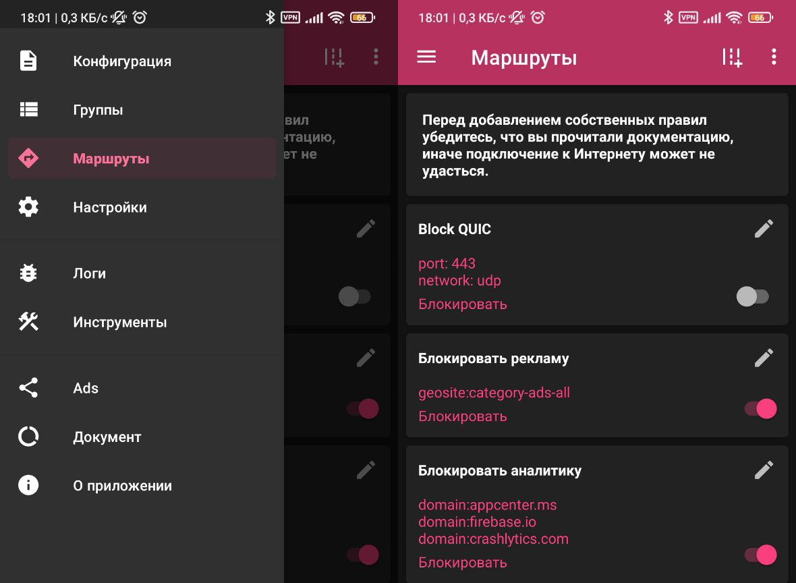
> 4. В правиле "Правило домена для Russia" меняем строку `geosite:ru` на строку `geosite:category-ru` (почему-то в версии 1.3.2 nekoray это вызывает проблему).
>    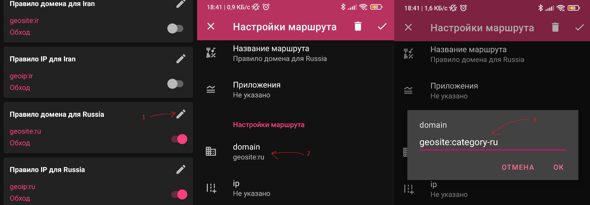
> 5. Добавляем правила для русских сайтов (о настройке маршрутизации на Андроид версии nekoray неплохо написано [здесь](https://telegra.ph/NekoBox-dlya-Android-moshchnyj-klient-dlya-OutlineShadowSocks-02-18)). В правом верхнем углу нажмите на значок "дороги" с плюсиком и в поле "domain" вставьте правила, перечисленные ниже:
>    ```JSON
>    keyword:yandex
>    keyword:yastatic
>    keyword:yadi.sk
>    keyword:xn--80aswg
>    keyword:xn--d1acpjx3f.xn--p1ai
>    keyword:xn--c1avg
>    keyword:xn--80asehdb
>    keyword:xn--p1acf
>    keyword:xn--p1ai
>    keyword:google.com
>    keyword:gstatic.com
>    keyword:yahoo
>    keyword:bing
>    keyword:tineye
>    keyword:duckduckgo
>    keyword:apple
>    keyword:vk.com
>    keyword:userapi.com
>    keyword:vk-cdn.me
>    keyword:mvk.com
>    keyword:vk-cdn.net
>    keyword:vk-portal.net
>    keyword:vk.cc
>    keyword:icq
>    keyword:livejournal
>    keyword:microsoft
>    keyword:live.com
>    keyword:login.live
>    keyword:tradingviewkeyword
>    domain:.ru
>    domain:.su
>    domain:.by
>    ``` 
>    Затем нажмите ОК и в самом низу в поле "outbound" выберите "Обход" (на самом деле это значит пускать трафик напрямую, а не через прокси). Нажмите на галочку в верхнем правом углу и убедитесь, что правило включено. При желании, здесь же можно указать и приложения, но мы их укажем через режим TUN/VPN.
>    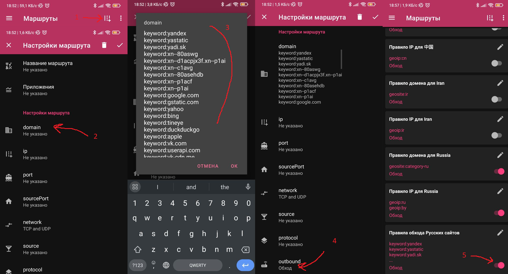
> 6. Снова открываем боковое меню и идём в раздел "Настройки". Убеждаемся, что включены "Сервисный режим" - VPN, "Реализация TUN" - Mixed, а также включён анализ трафика (режим sniff result for routing). Далее включаем "Режим VPN для приложений" (в разделе Настройка маршрута) и нажимаем на него, откроется окно, где можно выбрать приложения для проксирования. Сверху выбираем "прокси" и добавляем приложения, которые хотим проксировать (у меня это всё тот же youtube, discord и firefox).
>    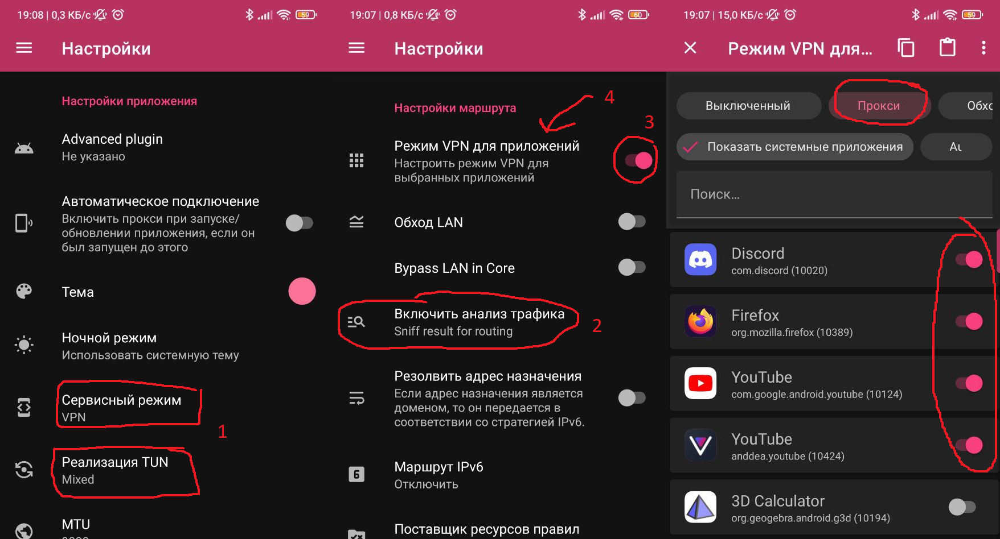
> 7. При необходимости, через меню "Инструменты"->"БЭКАП" можно импортировать или экспортировать все настройки приложения, в том числе маршрутов. Можете скопировать мои настройки, если лень делать всё самостоятельно. Для этого надо создать файл "nekobox_backuo.json" и скопировать в него содержимое [приложения 2](#Приложение%202%20-%20Содержимое%20файла%20с%20настройками%20маршрутов%20и%20конфигурации%20приложения%20Nekobox%20для%20Android), после чего в разделе "БЭКАП" выбрать импортировать из файла и указать этот файл на вашем телефоне.
> 8. Теперь вернитесь в меню "Конфигурация", выберите своё подключние (чтобы слева от него появилась полоска) и нажмите на иконку ~~свободы~~ самолётика. Если всё верно, прокси запустится, а снизу появится предложение проверить ваше подключение. Нажмите на него и, если вам написали что-то вроде "Успех: рукопожатие HTTP заняло 108 мс", значит всё нормально. Переходите к проверке работы ваших приложений и правильности маршрутизации трафика (смотри пункт ниже).

> [!NOTE]+ Проверка вашей маскировки
> Проверка для ПК и мобильного клиента выполняется идентично. Если вы всё сделали по инструкции — у вас на устройствах уже должен быть работающий прокси. Но выполняет ли он свою функцию? Проверим:
> 1. Убедитесь, что прокси включён;
> 2. Проверьте работу ваших приложений (если вы настраивали прокси не только для браузера): просмотр видео на YouTube или загрузку и работу голосовых каналов Discord.
> 3. В браузере зайдите на [https://ipinfo.io/](https://ipinfo.io/) или https://whatismyipaddress.com/. Вы видите IP вашего VPS-сервера? Значит прокси работает и он настроен верно;
>    Также проверьте и страну, которой принадлежит IP. Если страна не соответствует той, в которой вы покупали, значит IP "грязный". Просите техподдержку его сменить.
> 3. Зайдите на сайт https://2ip.ru/ и https://yandex.ru/internet/. Вы должны увидеть IP-адрес вашего ПК (Российский). Если вы не смогли зайти на сайт или там отображается IP-адрес вашего сервера, значит не верно настроена маршрутизация. Перепроверяйте.
> 4. Зайдите на [https://rutracker.org](https://rutracker.org/), https://www.youtube.com/. Если всё успешно загружается, значит РФ‑цензуру обошли.
> 5. Зайдите на [https://canva.com](https://canva.com/) Вы видите нормальный сайт и вас не посылают за то что вы из РФ? Значит западную цензуру обошли.
> 6. Зайдите на [https://google.com](https://google.com/). Нет ошибки 403 и поиск доступен? Значит гугл не забанил ранее ваш IP (если вы настраивали маршрутизацию к нему напрямую по инструкции, то он и так будет доступен, до тез пор пока у нас его не забанят).
> 8. Дополнительная проверка для опытных: Чтобы проверить, что маскировка работает как надо, добавьте IP-адрес вашего сервера и домен, под который вы маскируетесь, в hosts-файл (на Linux это /etc/hosts, на Windows это c:\windows\system32\drivers\etc\hosts), например, "38.25.63.10 www.microsoft.com", и после этого попробуйте зайти на этот адрес браузером - должна открыться настоящая страница этого домена с настоящим TLS-сертификатом.
> <br>
> 
>Если что-то пошло не так:
> 1. Перепроверьте настройки Xray на сервере.
> 2. Перепроверьте настройки маршрутизации на клиенте.
> 3. Посмотрите решение в[ этой статье](https://habr.com/ru/articles/770400/) на Хабр и комментариях (заблокирована в РФ).
> 4. Если на какой-то сайт вас не пускает или какой-то из сайтов работает не верно, смотрите в логах nekoray, куда идёт подключение и как (direct/proxy). Если к какому-то сайту подключение идёт явно не так, как надо, то либо из страны вашего сервера нельзя попасть на этот сайт, либо ошибка в правилах маршрутизации и тогда просто добавьте для него соответствующее правило маршрутизации.

---

## Шаг 8. Настройка дополнительных плюшек (опционально)
- To do...
	- Настройка telegram-бота для управления панелью.
	- Настройка механизма подписок для автоматического обновления настроек клиентов.

## Шаг X - Что можно улучшить?
- Если вы подключили много пользователей к вашему VPS или вас не устраивает скорость подключения к YouTube, то можно оптимизировать трафик сервера, включив BBR. Подробнее смотри в [этой статье](https://xtls.github.io/ru/document/level-0/ch07-xray-server.html#_7-7-%D0%BE%D0%BF%D1%82%D0%B8%D0%BC%D0%B8%D0%B7%D0%B0%D1%86%D0%B8%D1%8F-%D1%81%D0%B5%D1%80%D0%B2%D0%B5%D1%80%D0%B0-%D0%B2%D0%BA%D0%BB%D1%8E%D1%87%D0%B5%D0%BD%D0%B8%D0%B5-bbr) на сайте Project X.
	- _echo "net.core.default_qdisc=fq" >> /etc/sysctl.conf  
	  echo "net.ipv4.tcp_congestion_control=bbr" >> /etc/sysctl.conf  
	  sysctl -p_
- Настроить XRay напрямую без 3X-UI панели.
- Настроить VLESS-Reality  в режиме "steal from yourself", когда маскируетесь под собственный же сайт (настраивается Nginx с TLS-сертификатом и своим фейковым сайтом), но для этого нужен домен (плюс, что нет зависимости от чужого сайта). Не совсем понятно, какие здесь минусы.
- Безопасность:
	- Настроить резервное подключение через CDN (Cloudflare) через Websockets или gRPC.
	- Настроить подключение к зарубежным или Российским сайтам через сеть прокси-серверов **CloudFlare Warp** (для резервного способа обхода зарубежных блокировок).
	- Настроить port knocking (простукивания портов) для SSH ([пример на хабре](https://habr.com/ru/articles/179219/)).
	- Фильтрация входящих подключений к SSH по IP-адресам. Только определённые IP-адреса смогут подключаться к вашему серверу (защитит от любопытного РКН).
	- Сделайте проброс порта не только на 443/TCP-порт (его делает XTLS-Reality), а еще на 443/UDP и 80/TCP до сервера, под который вы маскируетесь. Например, если вы маскируетесь под www.microsoft.com, то отрезолвте его IP-адрес (с помощью nslookup, ping или какого-нибудь онлайн-сервиса), а потом добавьте правила iptables (можно засунуть в /etc/rc.local, если он у вас есть - см. инструкции для вашего Linux-дистрибутива):  
	  iptables -t nat -A PREROUTING -i eth0 -p udp --dport 443 -j DNAT --to-destination fake_site_ip:443
	  iptables -t nat -A PREROUTING -i eth0 -p tcp --dport 80 -j DNAT --to-destination fake_site_ip:80
	  (вместо eth0 должен быть ваш сетевой интерфейс, иногда бывает ens3, например).
	- Если ваш хостер позволяет менять PTR-записи для IP-адресов (так называемые "обратные DNS"), то поменяйте ее на такую, какая есть у IP-адреса сайта, под который вы маскируетесь, или хотя бы просто на сам этот домен.
- На своём ПК настроить какую-нибудь панель управления всеми серверами, чтобы просматривать их состояния, используемые ресурсы и прочее.

---

# Инструкция для тех, кто спешит
Здесь очень кратко выписаны все шаги и используемые команды для быстрой повторной настройки, например, второго резервного VPS или VPS для ваших знакомых.
1. Покупка VPS-сервера с 1-2 ядрами ЦП, 1-2 Гб ОЗУ, безлимитным трафиком, за 200-500р/месяц.
2. Проверка ip-адреса:
    - `ping server-ip`;
    - [чёрных списках РКН](https://blocklist.rkn.gov.ru/), [спам базах](https://2ip.ru/spam/);
    - местоположение сервера ([тут]([https://ipgeolocation.io/what-is-my-ip/194.105.82.110](https://ipgeolocation.io/what-is-my-ip/194.105.82.110)), [тут]([http://www.geoplugin.net/json.gp?ip=194.105.82.110](http://www.geoplugin.net/json.gp?ip=194.105.82.110)), [тут]([https://ipinfo.io/194.105.82.110](https://ipinfo.io/194.105.82.110)));
    - [https://looking.house/](https://looking.house/);
    - [официальные списки ip-адресов](https://bgp.he.net/);
    - `tracert server_ip`
3. Подключение к серверу:
   ```bash
   ssh root@xxx.xxx.xxx.xxx
   
   # Или
   ssh user_name@xxx.xxx.xxx.xxx -p port_number
   ```
   Смена пользователя:
   ```bash
   su -
   su user_name
   ```
4. Базовая настройка (root):
    - Смена пароля root:
      ```bash
      passwd
      ```
    - Обновление системы:
      ```bash
      apt update && apt upgrade -y && reboot
   ```
    - Новый пользователь:
      ```bash
      adduser user_name
   ```
    - Редактирование sshd_config (Port 54321, PermitRootLogin no, ):
      ```bash
      nano /etc/ssh/sshd_config
   ```
    - Перезапуск ssh:
      ```bash
      systemctl restart sshd
   ```
    - Подключение к ssh по ключам:
      ```bash
      # Генерация ключей и 
      ssh-keygen -t ed25519
      cat ~/.ssh/id_ed25519.pub | ssh user_name@server_ip  -p port_number "mkdir -p ~/.ssh && cat >> ~/.ssh/authorized_keys"
      
      # Или
      ssh-copy-id user_name@server_ip -p port_number
   ```
   ```bash
   New-Item -Path $HOME\.ssh\config -ItemType File
   ```
   
   
   

---
# В Заключение
Надеюсь, вы успешно прошли этот путь и смогли освободить свой интернет! А даже если у вас что-то не получилось, то это вполне нормально. У меня всё заработало ни с первого и даже ни со второго раза. Внимательно читайте инструкцию и особенно источники, которые я привожу ниже, и у вас всё обязательно получится)
Протокол VLESS не идеал, при наличии должной мотивации и финансирования, РКН рано или поздно сможет придумать как его заблокировать, однако к этому времени у нас будут ещё более стойкие и ещё более скрытные протоколы, чем этот. В конце концов, эта борьба "меча и щита" вряд ли когда-нибудь закончится, но мне хочется надеяться на это. Как говорится: "Надейся на лучшее, а готовься к худшему". Поэтому читайте и другие статьи на эту тему, пробуйте настраивать иные протоколы и скажите мне, если где-то в этой статье я допустил ошибку или неточность)


---

# Используемые источники
Большую часть информации я брал из замечательных статей Deleted-user (он же MiraclePtr) с habr.com. Если у вас нет возможности прочитать их в браузере (в РФ они заблокированы), можете скачать их с [моей страницы](https://github.com/EmptyLibra/Configure-Xray-with-VLESS-Reality-on-VPS-server) на github в виде html страниц. Множество комментариев с Хабр пользователя MiraclePtr тоже забанили после 2 марта 2024, так что я сохранил их отдельно.

- [i] [Статьи](https://habr.com/ru/articles/727868/) пользователя Deleted-user (раньше MiraclePtr, видимо, его банят периодически) на habr.com от 2023г о различных, устойчивых к блокировке протоколов и их настройке на собственном сервере (тут много теории и технических аспектов, крайне рекомендую, если интересует, как всё устроено изнутри). Весь его цикл состоит из 15 статей, вот ссылки на все:
	- [Раз](https://habr.com/ru/articles/710980/) ([html](Статьи_об_обходе_блокировок/1_Хабр_статьи_об_обходе_блокировок(MiraclePtr,%20Deleted-user)/1_Интернет-цензура%20и%20обход%20блокировок_%20не%20время%20расслабляться%20_%20Хабр%20(02.05.2024).html), [комментарии](Статьи_об_обходе_блокировок/1_Хабр_статьи_об_обходе_блокировок(MiraclePtr,%20Deleted-user)/Комментарии_к_статьям_до_бана/1_Интернет-цензура%20и%20обход%20блокировок：%20не%20время%20расслабляться%20_%20Комментарии%20_%20Хабр%20(24.11.2024%2013：02：26).html)) - краткая эволюция протоколов, устойчивых к блокировкам и способов их выявления;
	- [Два](https://habr.com/ru/articles/727868/) ([html](Статьи_об_обходе_блокировок/1_Хабр_статьи_об_обходе_блокировок(MiraclePtr,%20Deleted-user)/2_Современные%20технологии%20обхода%20блокировок_%20V2Ray,%20XRay,%20XTLS,%20Hysteria,%20Cloak%20и%20все-все-все%20_%20Хабр%20(02.05.2024).html), [комментарии](Статьи_об_обходе_блокировок/1_Хабр_статьи_об_обходе_блокировок(MiraclePtr,%20Deleted-user)/Комментарии_к_статьям_до_бана/2_Современные%20технологии%20обхода%20блокировок%20_%20Комментарии%20_%20Хабр%20(24.11.2024).html)) - современные способы обхода блокировок и их происхождение (V2Ray, XRay, XTLS, Hysteria, Cloak...);
	- [Три](https://habr.com/ru/articles/728696/) ([html](Статьи_об_обходе_блокировок/1_Хабр_статьи_об_обходе_блокировок(MiraclePtr,%20Deleted-user)/3_Программы-клиенты%20для%20протоколов%20недетектируемого%20обхода%20блокировок%20сайтов_%20V2Ray_XRay%20(02.05.2024).html), [комментарии](Статьи_об_обходе_блокировок/1_Хабр_статьи_об_обходе_блокировок(MiraclePtr,%20Deleted-user)/Комментарии_к_статьям_до_бана/3_Программы-клиенты%20для%20протоколов%20недетектируемого%20обхода%20блокировок%20сайтов_Комментарии.html)) - обзор программ-клиентов для связи с сервером по защищённым протоколам;
	- [Четыре](https://habr.com/ru/articles/728836/) ([html с комментариями](Статьи_об_обходе_блокировок/1_Хабр_статьи_об_обходе_блокировок(MiraclePtr,%20Deleted-user)/4_Обход%20блокировок_%20настройка%20сервера%20XRay%20для%20Shadowsocks-2022%20и%20VLESS%20с%20XTLS-Vision...%20_%20Хабр%20(02.05.2024).html)) - настройка сервера XRay для Shadowsocks-2022 и VLESS-XTLS-Vision;
	- [Пять](https://habr.com/ru/articles/731608/) ([html](Статьи_об_обходе_блокировок/1_Хабр_статьи_об_обходе_блокировок(MiraclePtr,%20Deleted-user)/5_Bleeding-edge%20обход%20блокировок%20с%20полной%20маскировкой_%20настраиваем%20сервер%20и%20клиент%20XRay%20с%20XTLS-Reality(02.05.2024).html), [комментарии](Статьи_об_обходе_блокировок/1_Хабр_статьи_об_обходе_блокировок(MiraclePtr,%20Deleted-user)/Комментарии_к_статьям_до_бана/5_Bleeding-edge%20обход%20блокировок%20с%20полной%20маскировкой：%20настраиваем%20сервер%20и%20клиент%20XRay%20с%20XTLS-Reality_Комментарии.html)) - настройка сервера и клиента Xray с VLESS-XTLS-Reality;
	- [Шесть](https://habr.com/ru/articles/735536/) ([html](Статьи_об_обходе_блокировок/1_Хабр_статьи_об_обходе_блокировок(MiraclePtr,%20Deleted-user)/6_3X-UI_%20Shadowsocks-2022%20&%20XRay%20(XTLS)%20сервер%20с%20простой%20настройкой%20и%20приятным%20интерфейсом%20_%20Хабр%20(02.05.2024).html), [комментарии](Статьи_об_обходе_блокировок/1_Хабр_статьи_об_обходе_блокировок(MiraclePtr,%20Deleted-user)/Комментарии_к_статьям_до_бана/6_3X-UI：%20Shadowsocks-2022%20&%20XRay%20(XTLS)%20сервер%20_%20Комментарии%20_%20Хабр%20(28.02.2024).html)) - настройка сервера через графическую панель 3X-UI;
	- [Семь](https://habr.com/ru/articles/761798/) ([html](Статьи_об_обходе_блокировок/1_Хабр_статьи_об_обходе_блокировок(MiraclePtr,%20Deleted-user)/7_Особенности%20проксирования%20через%20CDN_Websocket_gRPC%20для%20обхода%20блокировок%20_%20Хабр%20(02.05.2024).html), [комментарии](Статьи_об_обходе_блокировок/1_Хабр_статьи_об_обходе_блокировок(MiraclePtr,%20Deleted-user)/Комментарии_к_статьям_до_бана/7_Особенности%20проксирования%20через%20CDN_Websocket_gRPC%20_%20Комментарии%20_%20Хабр%20(25.02.2024).html)) - настройка подключения к серверу через CDN (Websocket, grpc);
	- [Восемь](https://habr.com/ru/articles/770400/) ([html](Статьи_об_обходе_блокировок/1_Хабр_статьи_об_обходе_блокировок(MiraclePtr,%20Deleted-user)/8_FAQ%20по%20Shadowsocks_XRay_XTLS_Reality_Nekobox_etc.%20для%20обхода%20блокировок%20_%20Хабр%20(02.05.2024).html), [комментарии](Статьи_об_обходе_блокировок/1_Хабр_статьи_об_обходе_блокировок(MiraclePtr,%20Deleted-user)/Комментарии_к_статьям_до_бана/8_FAQ%20по%20Shadowsocks_XRay_XTLS_Reality_Nekobox_etc.%20для%20обхода%20блокировок%20_%20Комментарии%20_%20Хабр%20(28.02.2024).html)) - частые вопросы/ответы по прошлым статьям и комментариям;
	- [Девять](https://habr.com/ru/articles/774838/) ([html](Статьи_об_обходе_блокировок/1_Хабр_статьи_об_обходе_блокировок(MiraclePtr,%20Deleted-user)/9_XRay%20(с%20VLESS_XTLS)_%20проброс%20портов,%20реверс-прокси,%20и%20псевдо-VPN%20_%20Хабр%20(02.05.2024).html), [комментарии](Статьи_об_обходе_блокировок/1_Хабр_статьи_об_обходе_блокировок(MiraclePtr,%20Deleted-user)/Комментарии_к_статьям_до_бана/9_XRay%20(с%20VLESS_XTLS)：%20проброс%20портов,%20реверс-прокси,%20и%20псевдо-VPN%20_%20Комментарии%20_%20Хабр%20(25.02.2024).html)) - получение доступа к корпоративной сети с помощью Xray (проброс портов, реверс-прокси);
	- [Десять](https://habr.com/ru/articles/776256/) ([html](Статьи_об_обходе_блокировок/1_Хабр_статьи_об_обходе_блокировок(MiraclePtr,%20Deleted-user)/10_OpenConnect_%20недетектируемый%20VPN,%20который%20вам%20понравится%20_%20Хабр%20(02.05.2024).html), [комментарии](Статьи_об_обходе_блокировок/1_Хабр_статьи_об_обходе_блокировок(MiraclePtr,%20Deleted-user)/Комментарии_к_статьям_до_бана/10_OpenConnect：%20недетектируемый%20VPN,%20который%20вам%20понравится%20_%20Комментарии%20_%20Хабр%20(25.02.2024).html)) - недектируемый VPN (именно VPN, а не прокси) OpenConnect и его настройка;
	- [Одиннадцать](https://habr.com/ru/articles/777656/) ([html](Статьи_об_обходе_блокировок/1_Хабр_статьи_об_обходе_блокировок(MiraclePtr,%20Deleted-user)/11_GOST_%20швейцарский%20нож%20для%20туннелирования%20и%20обхода%20блокировок%20_%20Хабр%20(02.05.2024).html), [комментарии](Статьи_об_обходе_блокировок/1_Хабр_статьи_об_обходе_блокировок(MiraclePtr,%20Deleted-user)/Комментарии_к_статьям_до_бана/11_GOST：%20швейцарский%20нож%20для%20туннелирования%20и%20обхода%20блокировок%20_%20Комментарии%20_%20Хабр%20(01.03.2024).html)) - GOST: швейцарский нож для туннелирования и обхода блокировок;
	- [Двенадцать](https://habr.com/ru/articles/778134/) ([html](Статьи_об_обходе_блокировок/1_Хабр_статьи_об_обходе_блокировок(MiraclePtr,%20Deleted-user)/12_Domain%20fronting%20для%20чайников,%20и%20как%20его%20использовать%20для%20обхода%20блокировок%20_%20Хабр%20(02.05.2024).html), [комментарии](Статьи_об_обходе_блокировок/1_Хабр_статьи_об_обходе_блокировок(MiraclePtr,%20Deleted-user)/Комментарии_к_статьям_до_бана/12_Domain%20fronting%20для%20чайников,%20и%20как%20его%20использовать%20для%20обхода%20блокировок%20_%20Комментарии%20_%20Хабр%20(01.03.2024).html)) - Domain fronting для чайников, и как его использовать для обхода блокировок;
	- [Тринадцать](https://habr.com/ru/articles/799751/) ([html](Статьи_об_обходе_блокировок/1_Хабр_статьи_об_обходе_блокировок(MiraclePtr,%20Deleted-user)/13_Надежный%20обход%20блокировок%20в%202024_%20протоколы,%20клиенты%20и%20настройка%20сервера%20_%20Хабр%20(25.09.2024).html)) - подробная статья с полной настройкой VPS сервера под неблокируемые протоколы 2024;
	- [Четырнадцать](https://habr.com/ru/articles/834290/) ([html](Статьи_об_обходе_блокировок/1_Хабр_статьи_об_обходе_блокировок(MiraclePtr,%20Deleted-user)/14_Малоизвестные%20фичи%20XRay,%20о%20которых%20невозможно%20молчать%20_%20Хабр%20(06.09.2024).html)) - Малоизвестные фичи XRay, о которых невозможно молчать;
	- [Пятнадцать](https://habr.com/ru/articles/837904/) ([html](Статьи_об_обходе_блокировок/1_Хабр_статьи_об_обходе_блокировок(MiraclePtr,%20Deleted-user)/15_Matrix_%20децентрализованные%20открытые%20мессенджеры%20с%20E2E-шифрованием%20(31.10.2024).html)) - Matrix: децентрализованные открытые мессенджеры с E2E-шифрованием.
- [i] [Статьи](https://xtls.github.io/ru/document/level-0/) разработчиков XRay (ProjectX) о детальной настройке голого Xray (подробный и для новичков).

Другие инструкции по настройке:
- [i] [Крайне грамотная статья](https://habr.com/ru/articles/799751/) от пользователя Deleted-user с habr.com по настройке VLESS-XTLS-Reality/ShadowSocks и многое другое в 2024г (она же №13 в списке выше).
- [i] [Статья](https://habr.com/ru/articles/785186/) ([html](Статьи_об_обходе_блокировок/3_Мануалы_по_настройке_proxy,vpn%20на%20VPS/1_ХАБР_Личный%20прокси%20для%20чайников_%20универсальный%20обход%20цензуры%20с%20помощью%20VPS,%203X-UI,%20Reality_CDN%20и%20Warp%20_%20Хабр%20(19.10.2024%2021_58_28).html)) пользователя quakin на habr.com с инструкцией по настройке VLESS-XTLS-Reality через панель 3X-UI, CDN и прочее.
- [i] [Инструкция](https://github.com/XTLS/Xray-core/discussions/3518) ([html](Статьи_об_обходе_блокировок/3_Мануалы_по_настройке_proxy,vpn%20на%20VPS/Настройка%20VLESS_TCP_%20REALITY_VISION%20_%20uTLS_XTLS_Xray-core_Discussion.html)) из обсуждения Xray на Github по настройке VLESS XTLS-Reality с подробным разбором механизмов его работы.
- [i] [Инструкция](https://habr.com/ru/articles/791724/) ([html](Статьи_об_обходе_блокировок/3_Мануалы_по_настройке_proxy,vpn%20на%20VPS/Как%20стать%20VPN%20провайдером%20за%20один%20вечер%20_%20Хабр%20(12.07.2024).html)) от пользователя 271828 с Хабр с автоматическим скриптом для установки, в том числе с Docker. 
- [i] [Видео](https://youtu.be/44BSRofsuBY) с канала zerodaily о настройке своего прокси с Vless-xtls-Reality через 3X-UI (проблемы с безопасностью).
- [i] Простенькая [инструкция](https://pikabu.ru/story/nastroyka_luchshikh_vpn_protokolov_vless_s_xtlsreality_na_servere_xray_s_ustanovkoy_cherez_3xui_panel_10782662) ([html](Статьи_об_обходе_блокировок/3_Мануалы_по_настройке_proxy,vpn%20на%20VPS/Настройка%20лучших%20VPN%20протоколов!%20VLESS%20с%20XTLS-Reality%20на%20сервере%20XRay%20с%20установкой%20через%203X-UI%20панель%20_%20Пикабу%20(19.10.2024).html)) с Пикабу о настройке Vless-xtls-Reality через 3X-UI (есть проблемы с безопасностью).

---

# Приложение 1 - Правила маршрутизации для клиента
- Подробно о правилах маршрутизации и всех полях можно почитать на [официальном сайте разработчика sing-box](https://sing-box.sagernet.org/configuration/route/rule/).

Правила маршрутизации пишутся в файле формата JSON (JavaScript Object Notation) - это текстовый формат данных, основанный на JavaScript. Как и многие другие текстовые форматы, JSON легко читается людьми. Для описания правил маршрутизации в JSON могут использоваться несколько видов значений:
- **Запись** - это неупорядоченное множество пар **ключ**:**значение**, заключённое в фигурные скобки `«{ }»`. Ключ описывается **строкой**, между ним и значением стоит символ `«:»`. Несколько пар _ключ-значение_ отделяются друг от друга запятыми.
  Например: `"outbound": "proxy"`.
- **Массив** (одномерный) — это упорядоченное множество **значений**. Массив заключается в квадратные скобки `«[ ]»`. Значения разделяются запятыми. Массив может быть пустым, то есть не содержать ни одного значения. Значения в пределах одного массива могут иметь разный тип. 
  Например: `"rules": [ ... ]`.
- Значения могут представлять собой вложенную структуру или содержать массивы.

Общий шаблон записи правил такой:
- Правила записываются в массива `"rules"` через запятую;
- Каждое правило ограничивается фигурными скобками `{ }`;
- Правила применяются сверху внизу по первому совпадению;
- Внутри простые правила для веб-страниц состоят всего из двух полей.
	- Первое - это одно из ключевых слов-шаблонов, задающих логику правила:
		- `"domain"` - правило соответствует, если домен полностью совпадает с шаблоном.
		- `"domain_suffix"` - правило соответствует, если домен запроса соответствует суффиксу. Например: шаблону «[google.com](http://google.com)» соответствует «[www.google.com](http://www.google.com)», «[mail.google.com](http://mail.google.com)» и «[google.com](http://google.com)», но не соответствует «[content-google.com](http://content-google.com)».
		- `"domain_keyword"` - правило соответствует, если домен запроса содержит ключевое слово. Например, шаблону "google" будут соответствовать все сайты из предыдущего примера и даже больше.
		- `"domain_regex"` - позволяет задать [регулярное выражение](https://ru.wikipedia.org/wiki/%D0%A0%D0%B5%D0%B3%D1%83%D0%BB%D1%8F%D1%80%D0%BD%D1%8B%D0%B5_%D0%B2%D1%8B%D1%80%D0%B0%D0%B6%D0%B5%D0%BD%D0%B8%D1%8F) для шаблона домен сайта.
		- `"geosite"` - совпадение по известному списку доменов, например "google" или "yandex".
		- `"geoip"` - совпадение по географическому расположению ip-адреса, например Россия (ru) или Белоруссия (by).
		- `"process_name"` - позволяет указать процессы, для которых будет применяться правило.
	- Вторым ключевым словом каждого правила является указание, что делать, если проверяемый сайт совпал с шаблоном (указание направления трафика (outbound)) : блокировать (block), проксировать (proxy) или пускать напрямую (direct). Например, `"outbound" : "direct"`.
- Правила применяются сверху вниз по первому совпадению. В одном правиле можно указать несколько шаблонов, если для них для всех применяется одно и то же направление трафика.
- При редактировании json файлов можно пользоваться инструментами вроде [_JSON Online Validator_](https://jsonlint.com/) для проверки форматирования.

Общий вид правил:
```JSON
{
    "rules": [
    	{
        	// Ключевые слова правила 1
			// ...
			
			// Направление трафика: direct, block или proxy
			"outbound": "direct"
		},
		{
			// Ключевые слова правила 2
			// "domain": [ "site1.com", "site2.ru" ]
			
			// Направление трафика: direct, block или proxy
			"outbound": "proxy"
		}, 
		{
			//...
		}
	]
}
```

Для записи правил исходящих маршрутов на клиенте можно воспользоваться следующим шаблоном (только в nekoray удаляйте комментарии, он их не поддерживает):
```JSON
{
	// Список правил маршрутизации
	"rules": [
		{
			// Правило 1
		},
		{
			// Правило 2
		},
		{
			// ...
		},
		{
			// Каждое правило может включать в себя следующие поля
			
			// 1. Полное совпадение по доменному имени
			"domain": [
				"google.com"
			],
			
			// 2. Совпадение по окончанию домена
			"domain_suffix": [
				".io", // Сайты, заканчивающиеся на .io
				".live",
				"xn--p1acf", // IP-адреса, содержащие кирилицу и переведённые
				"xn--p1ai",  // в формат латиницы (.рф, .мвд и т.д.)
			],
			
			// 3. Совпадение по ключевому слову в домене
			"domain_keyword": [
				"google" // Любые сайты, в адресе которых есть "google"
			],
			
			// 4. Совпадение по регулярному выражению
			"domain_regex": [
				".*goog.*\.com" // сайты вида *goog*.com
			],
			
			// 5. Совпадение по списку сайтов или доменов из некоторой базы данных
			"geosite": [
				"private", // частные адреса, включая .local
				"youtube" // Домены youtube
			],
			
			// 6. Совпадение по географическому расположению ip-адреса
			"geoip": [
				"private", // Частные ip-адреса
				"ru", // Россия
				"by"  // Белорусия
			],
			
			// Направление трафика: напрямую
			"outbound": "direct"
		},
		{
			// Проксирование трафика от некоторых приложений
			"outbound": "proxy",
			"process_name": [ 
				"Discord.exe", 
				"firefox.exe"
			]
		}
	]
}
```

- Российские ip адреса на кирилице .рф
  Используйте любой онлайновый punicode-конвертер, чтобы преобразовать их в адреса латиницей. Например, "мвд.рф" будет "xn--b1aew.xn--p1ai"
- geoip - это база данных стран и их ip-адресов. Правила ru - russia, by - belarus. Стран su, рф в этой базе не существует. 
- geosite - это база данных сервисов, например steam. Названий ru, su, by, рф в этой базе не существует.

---

# Приложение 2 - Содержимое файла с настройками маршрутов и конфигурации приложения Nekobox для Android
- Создайте файл "nekobox_backup.json".
- Вставьте в него содержимое ниже и импортируйте в приложении.
- В этом файле содержатся: настройки маршрутизации для маршрутизации сайтов РФ напрямую (а не через прокси), исправление косяка с маршрутом "geoip:ru" и включённые настройки VPN/TUN.
- Похоже, nekobox хранит это всё в каком-то зашифрованном виде, ну или у меня что-то криво отображается.
```
{
  "version": 1,
  "rules": [
    "AQAAAAAAAAAKAAAAQgBsAG8AYwBrACAAUQBVAEkAQwAAAAAAAQAAAAAAAAAAAAAAAAAAAAAAAAAAAAAAAAAAAAMAAAA0ADQAMwAAAAAAAAAAAAAAAwAAAHUAZABwAAAAAAAAAAAAAAAAAAAAAAAAAP7_________AAAAAA",
    "AgAAAAAAAAATAAAAEQQ7BD4EOgQ4BEAEPgQyBDAEQgRMBCAAQAQ1BDoEOwQwBDwEQwQAAAIAAAAAAAAAAQAAABgAAABnAGUAbwBzAGkAdABlADoAYwBhAHQAZQBnAG8AcgB5AC0AYQBkAHMALQBhAGwAbAAAAAAAAAAAAAAAAAAAAAAAAAAAAAAAAAAAAAAAAAAAAAAAAAAAAAAAAAAAAAAAAAAAAAAA_v________8AAAAA",
    "AwAAAAAAAAAVAAAAEQQ7BD4EOgQ4BEAEPgQyBDAEQgRMBCAAMAQ9BDAEOwQ4BEIEOAQ6BEMEAAADAAAAAAAAAAEAAAA9AAAAZABvAG0AYQBpAG4AOgBhAHAAcABjAGUAbgB0AGUAcgAuAG0AcwAKAGQAbwBtAGEAaQBuADoAZgBpAHIAZQBiAGEAcwBlAC4AaQBvAAoAZABvAG0AYQBpAG4AOgBjAHIAYQBzAGgAbAB5AHQAaQBjAHMALgBjAG8AbQAAAAAAAAAAAAAAAAAAAAAAAAAAAAAAAAAAAAAAAAAAAAAAAAAAAAAAAAAAAAAAAAAAAP7_________AAAAAA",
    "BAAAAAAAAAAZAAAAHwRABDAEMgQ4BDsEPgQgAFAAbABhAHkAIABTAHQAbwByAGUAIAA0BDsETwQgAC1O_VYAAAQAAAAAAAAAAAAAABQAAABkAG8AbQBhAGkAbgA6AGcAbwBvAGcAbABlAGEAcABpAHMALgBjAG4AAAAAAAAAAAAAAAAAAAAAAAAAAAAAAAAAAAAAAAAAAAAAAAAAAAAAAAAAAAAAAAAAAAAAAAAAAAAAAAAAAAAAAA",
    "BQAAAAAAAAAVAAAAHwRABDAEMgQ4BDsEPgQgADQEPgQ8BDUEPQQwBCAANAQ7BE8EIAAtTv1WAAAFAAAAAAAAAAAAAAAKAAAAZwBlAG8AcwBpAHQAZQA6AGMAbgAAAAAAAAAAAAAAAAAAAAAAAAAAAAAAAAAAAAAAAAAAAAAAAAAAAAAAAAAAAAAAAAAAAAAA__________8AAAAA",
    "BgAAAAAAAAARAAAAHwRABDAEMgQ4BDsEPgQgAEkAUAAgADQEOwRPBCAALU79VgAABgAAAAAAAAAAAAAAAAAAAAAAAAAIAAAAZwBlAG8AaQBwADoAYwBuAAAAAAAAAAAAAAAAAAAAAAAAAAAAAAAAAAAAAAAAAAAAAAAAAAAAAAAAAAAA__________8AAAAA",
    "BwAAAAAAAAAXAAAAHwRABDAEMgQ4BDsEPgQgADQEPgQ8BDUEPQQwBCAANAQ7BE8EIABJAHIAYQBuAAAABwAAAAAAAAAAAAAACgAAAGcAZQBvAHMAaQB0AGUAOgBpAHIAAAAAAAAAAAAAAAAAAAAAAAAAAAAAAAAAAAAAAAAAAAAAAAAAAAAAAAAAAAAAAAAAAAAAAP__________AAAAAA",
    "CAAAAAAAAAATAAAAHwRABDAEMgQ4BDsEPgQgAEkAUAAgADQEOwRPBCAASQByAGEAbgAAAAgAAAAAAAAAAAAAAAAAAAAAAAAACAAAAGcAZQBvAGkAcAA6AGkAcgAAAAAAAAAAAAAAAAAAAAAAAAAAAAAAAAAAAAAAAAAAAAAAAAAAAAAAAAAAAP__________AAAAAA",
    "CQAAAAAAAAAZAAAAHwRABDAEMgQ4BDsEPgQgADQEPgQ8BDUEPQQwBCAANAQ7BE8EIABSAHUAcwBzAGkAYQAAAAoAAAAAAAAAAQAAABMAAABnAGUAbwBzAGkAdABlADoAYwBhAHQAZQBnAG8AcgB5AC0AcgB1AAAAAAAAAAAAAAAAAAAAAAAAAAAAAAAAAAAAAAAAAAAAAAAAAAAAAAAAAAAAAAAAAAAA__________8AAAAA",
    "CgAAAAAAAAAVAAAAHwRABDAEMgQ4BDsEPgQgAEkAUAAgADQEOwRPBCAAUgB1AHMAcwBpAGEAAAALAAAAAAAAAAEAAAAAAAAAAAAAABEAAABnAGUAbwBpAHAAOgByAHUACgBnAGUAbwBpAHAAOgBiAHkAAAAAAAAAAAAAAAAAAAAAAAAAAAAAAAAAAAAAAAAAAAAAAAAAAAAAAAAA__________8AAAAA",
    "DAAAAAAAAAAdAAAAHwRABDAEMgQ4BDsEMAQgAD4EMQRFBD4ENAQwBCAAIARDBEEEQQQ6BDgERQQgAEEEMAQ5BEIEPgQyBAAADAAAAAAAAAABAAAAKwIAAGsAZQB5AHcAbwByAGQAOgB5AGEAbgBkAGUAeAAKAGsAZQB5AHcAbwByAGQAOgB5AGEAcwB0AGEAdABpAGMACgBrAGUAeQB3AG8AcgBkADoAeQBhAGQAaQAuAHMAawAKAGsAZQB5AHcAbwByAGQAOgB4AG4ALQAtADgAMABhAHMAdwBnAAoAawBlAHkAdwBvAHIAZAA6AHgAbgAtAC0AZAAxAGEAYwBwAGoAeAAzAGYALgB4AG4ALQAtAHAAMQBhAGkACgBrAGUAeQB3AG8AcgBkADoAeABuAC0ALQBjADEAYQB2AGcACgBrAGUAeQB3AG8AcgBkADoAeABuAC0ALQA4ADAAYQBzAGUAaABkAGIACgBrAGUAeQB3AG8AcgBkADoAeABuAC0ALQBwADEAYQBjAGYACgBrAGUAeQB3AG8AcgBkADoAeABuAC0ALQBwADEAYQBpAAoAawBlAHkAdwBvAHIAZAA6AGcAbwBvAGcAbABlAC4AYwBvAG0ACgBrAGUAeQB3AG8AcgBkADoAZwBzAHQAYQB0AGkAYwAuAGMAbwBtAAoAawBlAHkAdwBvAHIAZAA6AHkAYQBoAG8AbwAKAGsAZQB5AHcAbwByAGQAOgBiAGkAbgBnAAoAawBlAHkAdwBvAHIAZAA6AHQAaQBuAGUAeQBlAAoAawBlAHkAdwBvAHIAZAA6AGQAdQBjAGsAZAB1AGMAawBnAG8ACgBrAGUAeQB3AG8AcgBkADoAYQBwAHAAbABlAAoAawBlAHkAdwBvAHIAZAA6AHYAawAuAGMAbwBtAAoAawBlAHkAdwBvAHIAZAA6AHUAcwBlAHIAYQBwAGkALgBjAG8AbQAKAGsAZQB5AHcAbwByAGQAOgB2AGsALQBjAGQAbgAuAG0AZQAKAGsAZQB5AHcAbwByAGQAOgBtAHYAawAuAGMAbwBtAAoAawBlAHkAdwBvAHIAZAA6AHYAawAtAGMAZABuAC4AbgBlAHQACgBrAGUAeQB3AG8AcgBkADoAdgBrAC0AcABvAHIAdABhAGwALgBuAGUAdAAKAGsAZQB5AHcAbwByAGQAOgB2AGsALgBjAGMACgBrAGUAeQB3AG8AcgBkADoAaQBjAHEACgBrAGUAeQB3AG8AcgBkADoAbABpAHYAZQBqAG8AdQByAG4AYQBsAAoAawBlAHkAdwBvAHIAZAA6AG0AaQBjAHIAbwBzAG8AZgB0AAoAawBlAHkAdwBvAHIAZAA6AGwAaQB2AGUALgBjAG8AbQAKAGsAZQB5AHcAbwByAGQAOgBsAG8AZwBpAG4ALgBsAGkAdgBlAAoAawBlAHkAdwBvAHIAZAA6AHQAcgBhAGQAaQBuAGcAdgBpAGUAdwBrAGUAeQB3AG8AcgBkAAoAZABvAG0AYQBpAG4AOgAuAHIAdQAKAGQAbwBtAGEAaQBuADoALgBzAHUACgBkAG8AbQBhAGkAbgA6AC4AYgB5AAAAAAAAAAAAAAAAAAAAAAAAAAAAAAAAAAAAAAAAAAAAAAAAAAAAAAAAAAAAAAAAAAAA__________8AAAAA"
  ],
  "settings": [
    "CQAAAG0AaQB4AGUAZABQAG8AcgB0AAAABQAAAAQAAAAyMDgw",
    "DAAAAHAAbwByAHQATABvAGMAYQBsAEQAbgBzAAAAAAAFAAAABAAAADY0NTA",
    "DQAAAGkAcwBBAHUAdABvAEMAbwBuAG4AZQBjAHQAAAABAAAAAQAAAAAAAAA",
    "CgAAAG4AaQBnAGgAdABUAGgAZQBtAGUAAAAAAAUAAAABAAAAMAAAAA",
    "CwAAAHMAZQByAHYAaQBjAGUATQBvAGQAZQAAAAUAAAADAAAAdnBuAA",
    "EQAAAHQAdQBuAEkAbQBwAGwAZQBtAGUAbgB0AGEAdABpAG8AbgAAAAUAAAABAAAAMgAAAA",
    "AwAAAG0AdAB1AAAABQAAAAQAAAA5MDAw",
    "DQAAAHMAcABlAGUAZABJAG4AdABlAHIAdgBhAGwAAAAFAAAABAAAADEwMDA",
    "GAAAAHAAcgBvAGYAaQBsAGUAVAByAGEAZgBmAGkAYwBTAHQAYQB0AGkAcwB0AGkAYwBzAAAAAAABAAAAAQAAAAEAAAA",
    "FwAAAHMAaABvAHcARwByAG8AdQBwAEkAbgBOAG8AdABpAGYAaQBjAGEAdABpAG8AbgAAAAEAAAABAAAAAAAAAA",
    "EQAAAGEAbAB3AGEAeQBzAFMAaABvAHcAQQBkAGQAcgBlAHMAcwAAAAEAAAABAAAAAAAAAA",
    "DgAAAG0AZQB0AGUAcgBlAGQATgBlAHQAdwBvAHIAawAAAAAAAQAAAAEAAAAAAAAA",
    "DwAAAHMAaABvAHcARABpAHIAZQBjAHQAUwBwAGUAZQBkAAAAAQAAAAEAAAABAAAA",
    "CQAAAGIAeQBwAGEAcwBzAEwAYQBuAAAAAQAAAAEAAAAAAAAA",
    "DwAAAGIAeQBwAGEAcwBzAEwAYQBuAEkAbgBDAG8AcgBlAAAAAQAAAAEAAAAAAAAA",
    "DwAAAHQAcgBhAGYAZgBpAGMAUwBuAGkAZgBmAGkAbgBnAAAABQAAAAEAAAAxAAAA",
    "EgAAAHIAZQBzAG8AbAB2AGUARABlAHMAdABpAG4AYQB0AGkAbwBuAAAAAAABAAAAAQAAAAAAAAA",
    "CAAAAGkAcAB2ADYATQBvAGQAZQAAAAAABQAAAAEAAAAwAAAA",
    "DQAAAHIAdQBsAGUAcwBQAHIAbwB2AGkAZABlAHIAAAAFAAAAAQAAADAAAAA",
    "AwAAAG0AdQB4AAAABgAAAAAAAAA",
    "BwAAAG0AdQB4AFQAeQBwAGUAAAAFAAAAAQAAADAAAAA",
    "DgAAAG0AdQB4AEMAbwBuAGMAdQByAHIAZQBuAGMAeQAAAAAABQAAAAEAAAA4AAAA",
    "EwAAAGcAbABvAGIAYQBsAEEAbABsAG8AdwBJAG4AcwBlAGMAdQByAGUAAAABAAAAAQAAAAAAAAA",
    "CQAAAHIAZQBtAG8AdABlAEQAbgBzAAAABQAAABwAAABodHRwczovL2Rucy5nb29nbGUvZG5zLXF1ZXJ5",
    "GgAAAGQAbwBtAGEAaQBuAF8AcwB0AHIAYQB0AGUAZwB5AF8AZgBvAHIAXwByAGUAbQBvAHQAZQAAAAAABQAAAAQAAABhdXRv",
    "CQAAAGQAaQByAGUAYwB0AEQAbgBzAAAABQAAAB4AAABodHRwczovLzEyMC41My41My41My9kbnMtcXVlcnkAAA",
    "GgAAAGQAbwBtAGEAaQBuAF8AcwB0AHIAYQB0AGUAZwB5AF8AZgBvAHIAXwBkAGkAcgBlAGMAdAAAAAAABQAAAAQAAABhdXRv",
    "GgAAAGQAbwBtAGEAaQBuAF8AcwB0AHIAYQB0AGUAZwB5AF8AZgBvAHIAXwBzAGUAcgB2AGUAcgAAAAAABQAAAAQAAABhdXRv",
    "EAAAAGUAbgBhAGIAbABlAEQAbgBzAFIAbwB1AHQAaQBuAGcAAAAAAAEAAAABAAAAAQAAAA",
    "DQAAAGUAbgBhAGIAbABlAEYAYQBrAGUARABuAHMAAAABAAAAAQAAAAAAAAA",
    "DwAAAGEAcABwAGUAbgBkAEgAdAB0AHAAUAByAG8AeAB5AAAAAQAAAAEAAAAAAAAA",
    "CwAAAGEAbABsAG8AdwBBAGMAYwBlAHMAcwAAAAEAAAABAAAAAAAAAA",
    "EQAAAGMAbwBuAG4AZQBjAHQAaQBvAG4AVABlAHMAdABVAFIATAAAAAUAAAAZAAAAaHR0cDovL2NwLmNsb3VkZmxhcmUuY29tLwAAAA",
    "DwAAAGEAYwBxAHUAaQByAGUAVwBhAGsAZQBMAG8AYwBrAAAAAQAAAAEAAAAAAAAA",
    "DgAAAGUAbgBhAGIAbABlAEMAbABhAHMAaABBAFAASQAAAAAAAQAAAAEAAAAAAAAA",
    "FAAAAHQAYwBwAEsAZQBlAHAAQQBsAGkAdgBlAEkAbgB0AGUAcgB2AGEAbAAAAAAABQAAAAIAAAAxNQAA",
    "DQAAAGEAcABwAFQATABTAFYAZQByAHMAaQBvAG4AAAAFAAAAAwAAADEuMgA",
    "DQAAAHMAaABvAHcAQgBvAHQAdABvAG0AQgBhAHIAAAABAAAAAQAAAAAAAAA",
    "FgAAAGEAbABsAG8AdwBJAG4AcwBlAGMAdQByAGUATwBuAFIAZQBxAHUAZQBzAHQAAAAAAAEAAAABAAAAAAAAAA",
    "CAAAAGwAbwBnAEwAZQB2AGUAbAAAAAAABQAAAAEAAAAyAAAA",
    "CQAAAHAAcgBvAHgAeQBBAHAAcABzAAAAAQAAAAEAAAABAAAA",
    "CgAAAGIAeQBwAGEAcwBzAE0AbwBkAGUAAAAAAAEAAAABAAAAAAAAAA",
    "CgAAAGkAbgBkAGkAdgBpAGQAdQBhAGwAAAAAAAUAAABJAAAAY29tLmRpc2NvcmQKb3JnLm1vemlsbGEuZmlyZWZveApjb20uZ29vZ2xlLmFuZHJvaWQueW91dHViZQphbmRkZWEueW91dHViZQAAAA",
    "CQAAAHAAcgBvAGYAaQBsAGUASQBkAAAABAAAAAgAAAAAAAAAAAAAAQ",
    "DAAAAHAAcgBvAGYAaQBsAGUARwByAG8AdQBwAAAAAAAEAAAACAAAAAAAAAAAAAAB",
    "DgAAAHAAcgBvAGYAaQBsAGUAQwB1AHIAcgBlAG4AdAAAAAAABAAAAAgAAAAAAAAAAAAAAQ"
  ]
}
```

---

# История изменений
- 19.10.2024 - 04.11.2024: v1.0 - изучен материал и написана статья.
- 24.11.2024: дополнительно сохранены комментарии к статьям MiraclePtr с Хабр.
